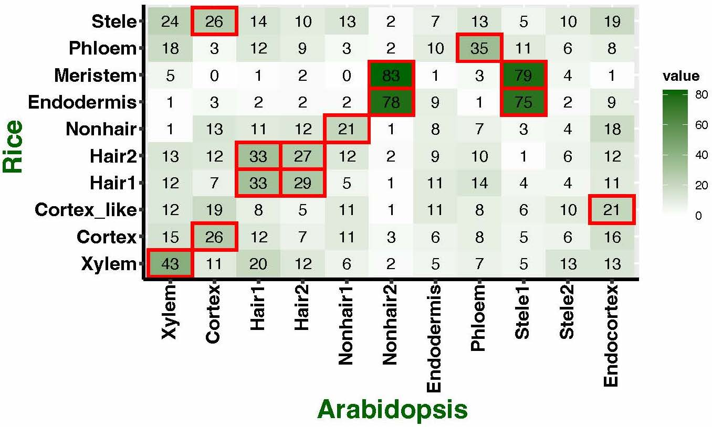
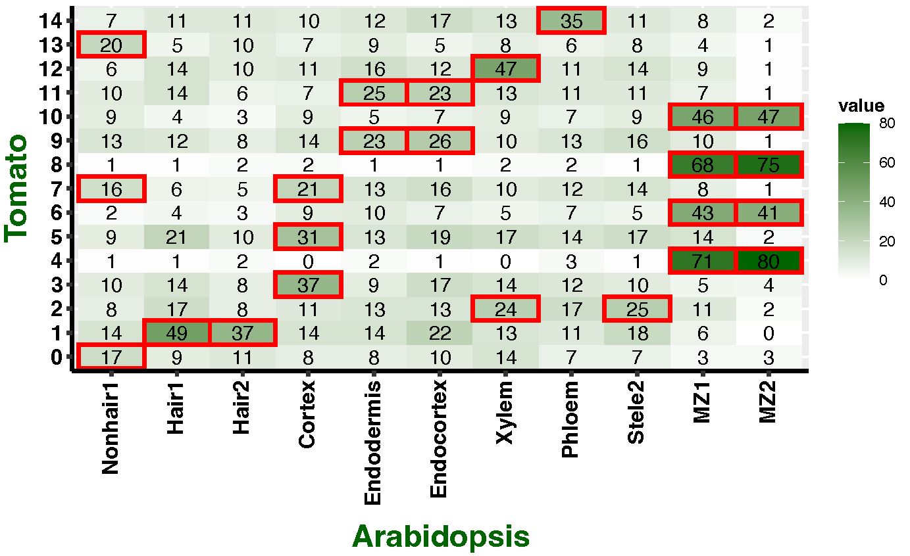

# Orthologous marker groups reveal broad cell identity conservation across single-cell transcriptomes in plants. 

### Introduction:
Despite the widespread application of single-cell RNA sequencing (scRNA-seq) inplant biology, the scarcity of known cell-type marker genes and the divergence of marker expression patterns limit the accuracy of cell-type identification in many species. To address this challenge, we have devised a novel computational strategy called Orthologous Marker Gene groups (OMGs) which can identify cell types in both model and non-model plant species. Our method does not depend on the complexity of cross-species data integration, thus is highly efficient, while still accurately determining inter species cellular similarities of diverse species. We validated our approach by analyzing published single-cell data from Arabidopsis,rice, and maize, and confirmed its accuracy in identifying cell types in tomato root and shoot apex tissues. The robustness of our method was further demonstrated by a successful mapping of 268 cell clusters from 1 million cells across 15 diverse plant species and various tissue types. Our findings suggest that the OMGs method, informed by reference single-cell maps, can accurately annotate cell types for most monocot and dicot species. 


<style type="text/css" rel="stylesheet">
.table-wrapper {
  overflow-x: scroll;
}
</style>

<div class="table-wrapper" markdown="block">


|      | p_val                 | avg_log2FC        | pct.1 | pct.2 | p_val_adj             | cluster             | gene      |
|------|-----------------------|-------------------|-------|-------|-----------------------|---------------------|-----------|
| 1    | 0                     | 2.90095300978765  | 0.565 | 0.142 | 0                     | Mesophyll           | AT1G70760 |
| 2    | 0                     | 2.6238082009726   | 0.795 | 0.386 | 0                     | Mesophyll           | AT5G38420 |
| 3    | 0                     | 2.58881862180251  | 0.797 | 0.445 | 0                     | Mesophyll           | AT2G34430 |
| 4    | 0                     | 2.58683422920828  | 0.631 | 0.246 | 0                     | Mesophyll           | AT3G01500 |
| 5    | 0                     | 2.46362991208773  | 0.64  | 0.193 | 0                     | Mesophyll           | AT5G48490 |
| 6    | 0                     | 2.35380015863722  | 0.747 | 0.355 | 0                     | Mesophyll           | AT5G38430 |
| 7    | 0                     | 2.34879953075602  | 0.64  | 0.299 | 0                     | Mesophyll           | AT5G14740 |
| 8    | 0                     | 2.34210612486089  | 0.608 | 0.206 | 0                     | Mesophyll           | AT2G39470 |
| 9    | 0                     | 2.32168661730413  | 0.821 | 0.329 | 0                     | Mesophyll           | AT2G10940 |
| 10   | 0                     | 2.31377985579424  | 0.675 | 0.234 | 0                     | Mesophyll           | AT3G63160 |
| 11   | 0                     | 2.28957832089616  | 0.831 | 0.477 | 0                     | Mesophyll           | AT3G27690 |
| 12   | 0                     | 2.28728227998529  | 0.527 | 0.139 | 0                     | Mesophyll           | AT1G19150 |
| 13   | 0                     | 2.23989909434224  | 0.568 | 0.162 | 0                     | Mesophyll           | AT1G32080 |
| 14   | 0                     | 2.19385866254029  | 0.976 | 0.871 | 0                     | Mesophyll           | AT5G38410 |
| 15   | 0                     | 2.19359829203033  | 0.776 | 0.362 | 0                     | Mesophyll           | AT1G72610 |
| 16   | 0                     | 2.15931575925662  | 0.731 | 0.478 | 0                     | Mesophyll           | AT2G25080 |
| 17   | 0                     | 2.0833059691607   | 0.687 | 0.277 | 0                     | Mesophyll           | AT5G09660 |
| 18   | 0                     | 2.07292008179086  | 0.619 | 0.223 | 0                     | Mesophyll           | AT2G01590 |
| 19   | 0                     | 2.0517601394488   | 0.876 | 0.654 | 0                     | Mesophyll           | AT2G46820 |
| 20   | 0                     | 2.00089992426327  | 0.784 | 0.381 | 0                     | Mesophyll           | AT2G45180 |
| 21   | 0                     | 1.96368763022292  | 0.917 | 0.769 | 0                     | Mesophyll           | AT2G26500 |
| 22   | 0                     | 1.96044701647096  | 0.765 | 0.468 | 0                     | Mesophyll           | AT3G47070 |
| 23   | 0                     | 1.94241287341918  | 0.899 | 0.755 | 0                     | Mesophyll           | AT1G30380 |
| 24   | 0                     | 1.93312660793088  | 0.581 | 0.198 | 0                     | Mesophyll           | AT4G13500 |
| 25   | 0                     | 1.91465194426489  | 0.553 | 0.23  | 0                     | Mesophyll           | AT1G43670 |
| 26   | 0                     | 1.90621576528807  | 0.983 | 0.828 | 0                     | Mesophyll           | AT1G29910 |
| 27   | 0                     | 1.89660969241816  | 0.902 | 0.468 | 0                     | Mesophyll           | AT1G12090 |
| 28   | 0                     | 1.89419281486519  | 0.512 | 0.153 | 0                     | Mesophyll           | AT2G38170 |
| 29   | 0                     | 1.86476175488773  | 0.51  | 0.21  | 0                     | Mesophyll           | AT4G35090 |
| 30   | 0                     | 1.86152807740614  | 0.952 | 0.846 | 0                     | Mesophyll           | AT5G64040 |
| 31   | 0                     | 1.8612226835085   | 0.598 | 0.223 | 0                     | Mesophyll           | AT1G22630 |
| 32   | 0                     | 1.85726411836723  | 0.592 | 0.24  | 0                     | Mesophyll           | AT4G39970 |
| 33   | 0                     | 1.85522509404587  | 0.536 | 0.176 | 0                     | Mesophyll           | AT3G15840 |
| 34   | 0                     | 1.84829102337372  | 0.59  | 0.205 | 0                     | Mesophyll           | AT1G74880 |
| 35   | 0                     | 1.83625305506978  | 0.827 | 0.56  | 0                     | Mesophyll           | AT4G09650 |
| 36   | 0                     | 1.8330383933331   | 0.729 | 0.344 | 0                     | Mesophyll           | AT5G45680 |
| 37   | 0                     | 1.81944093354826  | 0.904 | 0.699 | 0                     | Mesophyll           | AT1G12900 |
| 38   | 0                     | 1.81087354580695  | 0.587 | 0.237 | 0                     | Mesophyll           | AT3G48420 |
| 39   | 0                     | 1.80226717245191  | 0.771 | 0.363 | 0                     | Mesophyll           | AT3G14420 |
| 40   | 0                     | 1.79913052183794  | 0.944 | 0.823 | 0                     | Mesophyll           | AT4G28750 |
| 41   | 0                     | 1.7970560586613   | 0.547 | 0.236 | 0                     | Mesophyll           | AT1G53670 |
| 42   | 0                     | 1.78704978719968  | 0.672 | 0.318 | 0                     | Mesophyll           | AT3G63140 |
| 43   | 0                     | 1.78001265444102  | 0.603 | 0.275 | 0                     | Mesophyll           | AT2G27290 |
| 44   | 0                     | 1.77519574204052  | 0.723 | 0.31  | 0                     | Mesophyll           | AT2G13360 |
| 45   | 0                     | 1.7603452519764   | 0.977 | 0.867 | 0                     | Mesophyll           | AT1G29920 |
| 46   | 0                     | 1.74952901459393  | 0.925 | 0.76  | 0                     | Mesophyll           | AT2G39730 |
| 47   | 0                     | 1.72960627619124  | 0.768 | 0.432 | 0                     | Mesophyll           | AT1G43560 |
| 48   | 0                     | 1.72624999713786  | 0.76  | 0.423 | 0                     | Mesophyll           | AT3G55800 |
| 49   | 0                     | 1.72205875437734  | 0.779 | 0.413 | 0                     | Mesophyll           | AT4G28660 |
| 50   | 0                     | 1.69973487330401  | 0.761 | 0.411 | 0                     | Mesophyll           | AT1G75690 |
| 51   | 0                     | 1.6970326095837   | 0.733 | 0.402 | 0                     | Mesophyll           | AT5G08050 |
| 52   | 0                     | 1.69169463670566  | 0.968 | 0.897 | 0                     | Mesophyll           | AT1G08380 |
| 53   | 0                     | 1.68948215781737  | 0.626 | 0.256 | 0                     | Mesophyll           | AT3G22120 |
| 54   | 0                     | 1.68713039190192  | 0.638 | 0.311 | 0                     | Mesophyll           | AT1G18060 |
| 55   | 0                     | 1.68491703164749  | 0.791 | 0.437 | 0                     | Mesophyll           | AT1G09340 |
| 56   | 0                     | 1.68254319908337  | 0.579 | 0.252 | 0                     | Mesophyll           | AT1G18730 |
| 57   | 0                     | 1.67731343208896  | 0.904 | 0.708 | 0                     | Mesophyll           | AT4G05180 |
| 58   | 0                     | 1.67717599974725  | 0.998 | 0.989 | 0                     | Mesophyll           | AT1G67090 |
| 59   | 0                     | 1.67493148525631  | 0.957 | 0.847 | 0                     | Mesophyll           | AT1G55670 |
| 60   | 0                     | 1.6657319620172   | 0.818 | 0.537 | 0                     | Mesophyll           | AT1G23310 |
| 61   | 0                     | 1.6590356083784   | 0.678 | 0.305 | 0                     | Mesophyll           | AT3G54050 |
| 62   | 0                     | 1.65902158042148  | 0.804 | 0.503 | 0                     | Mesophyll           | AT2G21330 |
| 63   | 0                     | 1.65481856553108  | 0.506 | 0.215 | 0                     | Mesophyll           | AT4G02920 |
| 64   | 0                     | 1.65144335754854  | 0.607 | 0.29  | 0                     | Mesophyll           | AT2G46220 |
| 65   | 0                     | 1.64847574649182  | 0.607 | 0.271 | 0                     | Mesophyll           | AT5G43750 |
| 66   | 0                     | 1.64446667636859  | 0.664 | 0.306 | 0                     | Mesophyll           | AT1G55480 |
| 67   | 0                     | 1.64234061712375  | 0.956 | 0.846 | 0                     | Mesophyll           | AT4G01150 |
| 68   | 0                     | 1.63608602591653  | 0.811 | 0.498 | 0                     | Mesophyll           | AT1G03130 |
| 69   | 0                     | 1.62424521889254  | 0.664 | 0.353 | 0                     | Mesophyll           | AT1G44000 |
| 70   | 0                     | 1.61902208859283  | 0.935 | 0.692 | 0                     | Mesophyll           | AT4G38970 |
| 71   | 0                     | 1.61875975729415  | 0.854 | 0.577 | 0                     | Mesophyll           | AT1G42970 |
| 72   | 0                     | 1.61353609640245  | 0.89  | 0.675 | 0                     | Mesophyll           | AT4G32260 |
| 73   | 0                     | 1.6093282624512   | 0.849 | 0.578 | 0                     | Mesophyll           | AT4G34190 |
| 74   | 0                     | 1.60028674118635  | 0.804 | 0.5   | 0                     | Mesophyll           | AT5G24314 |
| 75   | 0                     | 1.58631987032994  | 0.694 | 0.353 | 0                     | Mesophyll           | AT5G07020 |
| 76   | 0                     | 1.57295020971514  | 0.789 | 0.518 | 0                     | Mesophyll           | AT4G37930 |
| 77   | 0                     | 1.57102722232364  | 0.609 | 0.241 | 0                     | Mesophyll           | AT1G62780 |
| 78   | 0                     | 1.57035678746989  | 0.753 | 0.427 | 0                     | Mesophyll           | AT5G02120 |
| 79   | 0                     | 1.56847846290886  | 0.965 | 0.878 | 0                     | Mesophyll           | AT2G06520 |
| 80   | 0                     | 1.56634899134708  | 0.63  | 0.302 | 0                     | Mesophyll           | AT1G76450 |
| 81   | 0                     | 1.56589548062428  | 0.98  | 0.914 | 0                     | Mesophyll           | AT5G54270 |
| 82   | 0                     | 1.55203249189646  | 0.748 | 0.42  | 0                     | Mesophyll           | AT3G46780 |
| 83   | 0                     | 1.55165747588941  | 0.542 | 0.216 | 0                     | Mesophyll           | AT5G36120 |
| 84   | 0                     | 1.54866212672212  | 0.925 | 0.75  | 0                     | Mesophyll           | AT3G62030 |
| 85   | 0                     | 1.54538629126506  | 0.951 | 0.857 | 0                     | Mesophyll           | AT1G20340 |
| 86   | 0                     | 1.54449534476725  | 0.989 | 0.96  | 0                     | Mesophyll           | AT1G79040 |
| 87   | 0                     | 1.53707686378498  | 0.717 | 0.362 | 0                     | Mesophyll           | AT1G74730 |
| 88   | 0                     | 1.535812947485    | 0.734 | 0.415 | 0                     | Mesophyll           | AT5G23060 |
| 89   | 0                     | 1.51733530067025  | 0.73  | 0.384 | 0                     | Mesophyll           | AT3G55330 |
| 90   | 0                     | 1.51694522129932  | 0.64  | 0.304 | 0                     | Mesophyll           | AT1G49975 |
| 91   | 0                     | 1.5136890645062   | 0.535 | 0.202 | 0                     | Mesophyll           | AT4G28030 |
| 92   | 0                     | 1.50782564205751  | 0.846 | 0.614 | 0                     | Mesophyll           | AT4G04640 |
| 93   | 0                     | 1.50253167482995  | 0.877 | 0.632 | 0                     | Mesophyll           | AT1G21500 |
| 94   | 0                     | 1.50196037834552  | 0.793 | 0.487 | 0                     | Mesophyll           | AT1G32060 |
| 95   | 0                     | 1.50148051731233  | 0.835 | 0.586 | 0                     | Mesophyll           | ATCG00440 |
| 96   | 0                     | 1.50062196687481  | 0.819 | 0.534 | 0                     | Mesophyll           | AT1G20020 |
| 97   | 0                     | 1.49547327364511  | 0.685 | 0.348 | 0                     | Mesophyll           | AT3G50685 |
| 98   | 0                     | 1.49374685454027  | 0.691 | 0.364 | 0                     | Mesophyll           | AT5G52970 |
| 99   | 0                     | 1.47146818059259  | 0.807 | 0.488 | 0                     | Mesophyll           | AT3G50820 |
| 100  | 0                     | 1.46366285218442  | 0.599 | 0.251 | 0                     | Mesophyll           | AT5G16030 |
| 101  | 0                     | 1.45791378434888  | 0.79  | 0.514 | 0                     | Mesophyll           | AT4G22890 |
| 102  | 0                     | 1.45316253507448  | 0.964 | 0.849 | 0                     | Mesophyll           | AT1G15820 |
| 103  | 0                     | 1.4509514864082   | 0.66  | 0.326 | 0                     | Mesophyll           | AT4G02725 |
| 104  | 0                     | 1.45041308247504  | 0.741 | 0.389 | 0                     | Mesophyll           | AT2G43560 |
| 105  | 0                     | 1.44830510682817  | 0.92  | 0.771 | 0                     | Mesophyll           | AT4G03280 |
| 106  | 0                     | 1.44636740085503  | 0.891 | 0.653 | 0                     | Mesophyll           | AT3G27160 |
| 107  | 0                     | 1.44597715406822  | 0.502 | 0.197 | 0                     | Mesophyll           | AT3G10060 |
| 108  | 0                     | 1.44471025710904  | 0.93  | 0.769 | 0                     | Mesophyll           | AT4G21280 |
| 109  | 0                     | 1.44453351807903  | 0.501 | 0.217 | 0                     | Mesophyll           | AT2G45740 |
| 110  | 0                     | 1.44064530886699  | 0.522 | 0.24  | 0                     | Mesophyll           | AT5G17170 |
| 111  | 0                     | 1.4391161228272   | 0.97  | 0.887 | 0                     | Mesophyll           | AT1G61520 |
| 112  | 0                     | 1.4374677768711   | 0.694 | 0.38  | 0                     | Mesophyll           | AT5G23120 |
| 113  | 0                     | 1.43431152455635  | 0.79  | 0.463 | 0                     | Mesophyll           | AT4G09010 |
| 114  | 0                     | 1.43054744265307  | 0.944 | 0.815 | 0                     | Mesophyll           | AT3G21055 |
| 115  | 0                     | 1.42372448279691  | 0.506 | 0.229 | 0                     | Mesophyll           | AT5G20630 |
| 116  | 0                     | 1.4162826915066   | 0.627 | 0.304 | 0                     | Mesophyll           | AT4G35250 |
| 117  | 0                     | 1.40703429996502  | 0.678 | 0.376 | 0                     | Mesophyll           | AT5G51010 |
| 118  | 0                     | 1.39923722348563  | 0.641 | 0.335 | 0                     | Mesophyll           | AT3G15850 |
| 119  | 0                     | 1.39795801433598  | 0.935 | 0.824 | 0                     | Mesophyll           | AT1G52230 |
| 120  | 0                     | 1.39316551896396  | 0.515 | 0.223 | 0                     | Mesophyll           | AT5G57345 |
| 121  | 0                     | 1.383052464218    | 0.699 | 0.448 | 0                     | Mesophyll           | AT1G58290 |
| 122  | 0                     | 1.37589995661168  | 0.826 | 0.57  | 0                     | Mesophyll           | AT5G61410 |
| 123  | 0                     | 1.37515243204122  | 0.506 | 0.206 | 0                     | Mesophyll           | AT1G09750 |
| 124  | 0                     | 1.36906838084652  | 0.978 | 0.904 | 0                     | Mesophyll           | AT3G61470 |
| 125  | 0                     | 1.36797657335901  | 0.601 | 0.26  | 0                     | Mesophyll           | AT4G39710 |
| 126  | 0                     | 1.36351266158556  | 0.778 | 0.549 | 0                     | Mesophyll           | AT2G04700 |
| 127  | 0                     | 1.36067351325139  | 0.983 | 0.934 | 0                     | Mesophyll           | AT3G47470 |
| 128  | 0                     | 1.35755681171097  | 0.568 | 0.297 | 0                     | Mesophyll           | AT1G80380 |
| 129  | 0                     | 1.35338076109929  | 0.684 | 0.354 | 0                     | Mesophyll           | AT1G03630 |
| 130  | 0                     | 1.35283845613285  | 0.714 | 0.451 | 0                     | Mesophyll           | AT1G16880 |
| 131  | 0                     | 1.34982391473837  | 0.987 | 0.942 | 0                     | Mesophyll           | AT1G31330 |
| 132  | 0                     | 1.34937594095711  | 0.678 | 0.392 | 0                     | Mesophyll           | AT1G65260 |
| 133  | 0                     | 1.34881923128236  | 0.831 | 0.526 | 0                     | Mesophyll           | AT5G47190 |
| 134  | 0                     | 1.3483768492269   | 0.991 | 0.953 | 0                     | Mesophyll           | AT2G34420 |
| 135  | 0                     | 1.34798088805564  | 0.658 | 0.348 | 0                     | Mesophyll           | AT4G00895 |
| 136  | 0                     | 1.34654161261474  | 0.91  | 0.692 | 0                     | Mesophyll           | AT3G08940 |
| 137  | 0                     | 1.34100706884493  | 0.505 | 0.203 | 0                     | Mesophyll           | AT3G08920 |
| 138  | 0                     | 1.3393618292542   | 0.539 | 0.253 | 0                     | Mesophyll           | AT1G22850 |
| 139  | 0                     | 1.33685000505579  | 0.89  | 0.724 | 0                     | Mesophyll           | AT3G16140 |
| 140  | 0                     | 1.3364356846099   | 0.977 | 0.904 | 0                     | Mesophyll           | AT5G01530 |
| 141  | 0                     | 1.33401104841499  | 0.821 | 0.547 | 0                     | Mesophyll           | AT1G03680 |
| 142  | 0                     | 1.33396644074053  | 0.525 | 0.237 | 0                     | Mesophyll           | AT4G23890 |
| 143  | 0                     | 1.32922780392663  | 0.965 | 0.928 | 0                     | Mesophyll           | ATCG00470 |
| 144  | 0                     | 1.32640693053104  | 0.855 | 0.565 | 0                     | Mesophyll           | AT1G68590 |
| 145  | 0                     | 1.32541913924997  | 0.746 | 0.398 | 0                     | Mesophyll           | AT4G17600 |
| 146  | 0                     | 1.32100981446912  | 0.706 | 0.381 | 0                     | Mesophyll           | AT1G45474 |
| 147  | 0                     | 1.32012848678588  | 0.976 | 0.909 | 0                     | Mesophyll           | AT5G66570 |
| 148  | 0                     | 1.3174737134431   | 0.599 | 0.286 | 0                     | Mesophyll           | AT5G38520 |
| 149  | 0                     | 1.31666780594408  | 0.929 | 0.791 | 0                     | Mesophyll           | AT4G02770 |
| 150  | 0                     | 1.31449763323189  | 0.927 | 0.794 | 0                     | Mesophyll           | AT3G26650 |
| 151  | 0                     | 1.31145908351792  | 0.796 | 0.535 | 0                     | Mesophyll           | AT1G54780 |
| 152  | 0                     | 1.31110192683328  | 0.868 | 0.657 | 0                     | Mesophyll           | AT1G67740 |
| 153  | 0                     | 1.31082601231692  | 0.717 | 0.428 | 0                     | Mesophyll           | AT2G05310 |
| 154  | 0                     | 1.30925112052296  | 0.728 | 0.465 | 0                     | Mesophyll           | AT4G10300 |
| 155  | 0                     | 1.30765579031825  | 0.632 | 0.316 | 0                     | Mesophyll           | AT5G52960 |
| 156  | 0                     | 1.30485956310508  | 0.561 | 0.248 | 0                     | Mesophyll           | AT2G03420 |
| 157  | 0                     | 1.30416254389492  | 0.526 | 0.232 | 0                     | Mesophyll           | AT1G20810 |
| 158  | 0                     | 1.30315146370202  | 0.851 | 0.578 | 0                     | Mesophyll           | AT3G47650 |
| 159  | 0                     | 1.30260361817263  | 0.792 | 0.477 | 0                     | Mesophyll           | AT3G08740 |
| 160  | 0                     | 1.30175657962514  | 0.593 | 0.269 | 0                     | Mesophyll           | AT3G22210 |
| 161  | 0                     | 1.29982512120091  | 0.627 | 0.285 | 0                     | Mesophyll           | AT2G29180 |
| 162  | 0                     | 1.29776801976991  | 0.748 | 0.448 | 0                     | Mesophyll           | AT2G05620 |
| 163  | 0                     | 1.2972954569123   | 0.77  | 0.443 | 0                     | Mesophyll           | AT5G06290 |
| 164  | 0                     | 1.29386257331419  | 0.907 | 0.72  | 0                     | Mesophyll           | AT1G29070 |
| 165  | 0                     | 1.29210809455357  | 0.756 | 0.473 | 0                     | Mesophyll           | AT1G68010 |
| 166  | 0                     | 1.28519691090553  | 0.601 | 0.269 | 0                     | Mesophyll           | AT5G55220 |
| 167  | 0                     | 1.28469799661194  | 0.536 | 0.272 | 0                     | Mesophyll           | AT5G17230 |
| 168  | 0                     | 1.28445838477625  | 0.554 | 0.259 | 0                     | Mesophyll           | AT3G56010 |
| 169  | 0                     | 1.28293603146849  | 0.834 | 0.652 | 0                     | Mesophyll           | AT1G51400 |
| 170  | 0                     | 1.28041506244988  | 0.783 | 0.494 | 0                     | Mesophyll           | AT5G28750 |
| 171  | 0                     | 1.28037056919395  | 0.884 | 0.666 | 0                     | Mesophyll           | AT2G24090 |
| 172  | 0                     | 1.28031695820455  | 0.541 | 0.285 | 0                     | Mesophyll           | AT5G57040 |
| 173  | 0                     | 1.28016322670047  | 0.99  | 0.949 | 0                     | Mesophyll           | AT3G54890 |
| 174  | 0                     | 1.27972755186761  | 0.588 | 0.275 | 0                     | Mesophyll           | AT3G45050 |
| 175  | 0                     | 1.27536141160472  | 0.909 | 0.75  | 0                     | Mesophyll           | AT2G20260 |
| 176  | 0                     | 1.2734576666131   | 0.58  | 0.265 | 0                     | Mesophyll           | AT5G18660 |
| 177  | 0                     | 1.2706333761189   | 0.802 | 0.485 | 0                     | Mesophyll           | AT3G15360 |
| 178  | 0                     | 1.26968825210689  | 0.967 | 0.902 | 0                     | Mesophyll           | AT2G30570 |
| 179  | 0                     | 1.2684217013364   | 0.526 | 0.234 | 0                     | Mesophyll           | AT2G33180 |
| 180  | 0                     | 1.26694762461019  | 0.565 | 0.253 | 0                     | Mesophyll           | AT5G45930 |
| 181  | 0                     | 1.26417237112816  | 0.846 | 0.563 | 0                     | Mesophyll           | AT1G64510 |
| 182  | 0                     | 1.25996034481338  | 0.822 | 0.532 | 0                     | Mesophyll           | AT4G18480 |
| 183  | 0                     | 1.258433853329    | 0.939 | 0.806 | 0                     | Mesophyll           | AT4G25050 |
| 184  | 0                     | 1.25834282971989  | 0.508 | 0.233 | 0                     | Mesophyll           | AT4G31530 |
| 185  | 0                     | 1.2561622654604   | 0.849 | 0.551 | 0                     | Mesophyll           | AT1G32990 |
| 186  | 0                     | 1.25503982069852  | 0.592 | 0.277 | 0                     | Mesophyll           | AT4G11175 |
| 187  | 0                     | 1.25323776635866  | 0.642 | 0.315 | 0                     | Mesophyll           | AT3G04790 |
| 188  | 0                     | 1.25213939752896  | 0.57  | 0.256 | 0                     | Mesophyll           | AT5G14660 |
| 189  | 0                     | 1.24923533493785  | 0.752 | 0.393 | 0                     | Mesophyll           | AT3G63190 |
| 190  | 0                     | 1.24915892211196  | 0.828 | 0.549 | 0                     | Mesophyll           | AT2G42220 |
| 191  | 0                     | 1.24845172561252  | 0.503 | 0.228 | 0                     | Mesophyll           | AT1G32220 |
| 192  | 0                     | 1.24754889570048  | 0.882 | 0.663 | 0                     | Mesophyll           | AT5G54600 |
| 193  | 0                     | 1.24677537815134  | 0.79  | 0.45  | 0                     | Mesophyll           | AT5G51110 |
| 194  | 0                     | 1.24308222005321  | 0.99  | 0.952 | 0                     | Mesophyll           | AT4G10340 |
| 195  | 0                     | 1.23888490264376  | 0.614 | 0.315 | 0                     | Mesophyll           | AT4G28025 |
| 196  | 0                     | 1.23335755112018  | 0.575 | 0.273 | 0                     | Mesophyll           | AT5G42270 |
| 197  | 0                     | 1.2177331644129   | 0.514 | 0.224 | 0                     | Mesophyll           | AT5G04140 |
| 198  | 0                     | 1.2162199030889   | 0.693 | 0.426 | 0                     | Mesophyll           | AT3G59400 |
| 199  | 0                     | 1.2152423464711   | 0.943 | 0.783 | 0                     | Mesophyll           | AT2G05070 |
| 200  | 0                     | 1.21463785302139  | 0.728 | 0.494 | 0                     | Mesophyll           | AT1G21065 |
| 201  | 0                     | 1.21382040743701  | 0.539 | 0.272 | 0                     | Mesophyll           | AT1G50020 |
| 202  | 0                     | 1.21380476973495  | 0.789 | 0.461 | 0                     | Mesophyll           | AT4G17560 |
| 203  | 0                     | 1.20933271582642  | 0.586 | 0.29  | 0                     | Mesophyll           | AT1G14345 |
| 204  | 0                     | 1.20836173623924  | 0.756 | 0.407 | 0                     | Mesophyll           | AT3G14415 |
| 205  | 0                     | 1.20630529658053  | 0.505 | 0.22  | 0                     | Mesophyll           | AT5G19220 |
| 206  | 0                     | 1.20388154750568  | 0.676 | 0.373 | 0                     | Mesophyll           | AT2G48070 |
| 207  | 0                     | 1.20168962340873  | 0.69  | 0.372 | 0                     | Mesophyll           | AT4G33010 |
| 208  | 0                     | 1.19752338736755  | 0.653 | 0.337 | 0                     | Mesophyll           | AT3G63540 |
| 209  | 0                     | 1.19579602469824  | 1     | 0.997 | 0                     | Mesophyll           | AT1G29930 |
| 210  | 0                     | 1.19119291540998  | 0.568 | 0.275 | 0                     | Mesophyll           | AT3G26900 |
| 211  | 0                     | 1.18855659145611  | 0.857 | 0.64  | 0                     | Mesophyll           | AT1G03600 |
| 212  | 0                     | 1.1866779291607   | 0.71  | 0.387 | 0                     | Mesophyll           | AT5G21920 |
| 213  | 0                     | 1.18566907751395  | 0.654 | 0.323 | 0                     | Mesophyll           | AT1G32550 |
| 214  | 0                     | 1.18333171065155  | 0.696 | 0.394 | 0                     | Mesophyll           | AT1G76080 |
| 215  | 0                     | 1.1815977017178   | 0.554 | 0.258 | 0                     | Mesophyll           | AT4G24930 |
| 216  | 0                     | 1.18044031224028  | 0.849 | 0.573 | 0                     | Mesophyll           | AT2G33450 |
| 217  | 0                     | 1.18041350411289  | 0.521 | 0.244 | 0                     | Mesophyll           | AT3G23700 |
| 218  | 0                     | 1.17629042622456  | 0.573 | 0.291 | 0                     | Mesophyll           | AT5G55710 |
| 219  | 0                     | 1.17550079130849  | 0.724 | 0.427 | 0                     | Mesophyll           | AT5G53490 |
| 220  | 0                     | 1.17487991437189  | 0.799 | 0.533 | 0                     | Mesophyll           | AT5G66190 |
| 221  | 0                     | 1.16754497512542  | 0.571 | 0.259 | 0                     | Mesophyll           | AT2G44920 |
| 222  | 0                     | 1.16505857538295  | 0.72  | 0.403 | 0                     | Mesophyll           | AT4G02530 |
| 223  | 0                     | 1.16312262051821  | 0.556 | 0.273 | 0                     | Mesophyll           | AT2G43945 |
| 224  | 0                     | 1.16275307253676  | 0.897 | 0.68  | 0                     | Mesophyll           | AT3G54210 |
| 225  | 0                     | 1.16203241915803  | 0.613 | 0.326 | 0                     | Mesophyll           | AT2G21385 |
| 226  | 0                     | 1.16006297557622  | 0.66  | 0.388 | 0                     | Mesophyll           | AT5G36790 |
| 227  | 0                     | 1.15885257168167  | 0.848 | 0.57  | 0                     | Mesophyll           | AT5G14910 |
| 228  | 0                     | 1.1585319177368   | 0.506 | 0.247 | 0                     | Mesophyll           | AT3G24430 |
| 229  | 0                     | 1.15165454068994  | 0.922 | 0.744 | 0                     | Mesophyll           | AT3G56910 |
| 230  | 0                     | 1.14740012935236  | 0.702 | 0.412 | 0                     | Mesophyll           | AT4G16410 |
| 231  | 0                     | 1.14617741165188  | 0.858 | 0.573 | 0                     | Mesophyll           | AT3G52150 |
| 232  | 0                     | 1.14433882457702  | 0.569 | 0.29  | 0                     | Mesophyll           | AT1G77490 |
| 233  | 0                     | 1.1420108037188   | 0.75  | 0.49  | 0                     | Mesophyll           | AT1G34000 |
| 234  | 0                     | 1.13840089130872  | 0.603 | 0.302 | 0                     | Mesophyll           | AT2G32180 |
| 235  | 0                     | 1.13582074338921  | 0.655 | 0.356 | 0                     | Mesophyll           | AT3G12345 |
| 236  | 0                     | 1.12960018786775  | 0.59  | 0.304 | 0                     | Mesophyll           | AT4G13220 |
| 237  | 0                     | 1.12786699943024  | 0.878 | 0.635 | 0                     | Mesophyll           | AT4G01310 |
| 238  | 0                     | 1.12723812349613  | 0.935 | 0.75  | 0                     | Mesophyll           | AT1G44575 |
| 239  | 0                     | 1.1267412070958   | 0.631 | 0.332 | 0                     | Mesophyll           | AT5G16400 |
| 240  | 0                     | 1.12535613021306  | 0.734 | 0.432 | 0                     | Mesophyll           | AT3G61870 |
| 241  | 0                     | 1.12391310388449  | 0.656 | 0.342 | 0                     | Mesophyll           | AT1G62750 |
| 242  | 0                     | 1.12000559261092  | 0.897 | 0.678 | 0                     | Mesophyll           | AT3G25920 |
| 243  | 0                     | 1.12000292433585  | 0.797 | 0.489 | 0                     | Mesophyll           | AT5G65220 |
| 244  | 0                     | 1.11951033147807  | 0.588 | 0.302 | 0                     | Mesophyll           | AT2G27680 |
| 245  | 0                     | 1.11686465830188  | 0.902 | 0.687 | 0                     | Mesophyll           | AT1G48350 |
| 246  | 0                     | 1.11535681913629  | 0.869 | 0.622 | 0                     | Mesophyll           | AT1G74970 |
| 247  | 0                     | 1.11388679920553  | 0.612 | 0.311 | 0                     | Mesophyll           | AT5G52440 |
| 248  | 0                     | 1.11241369064852  | 0.675 | 0.39  | 0                     | Mesophyll           | AT2G28800 |
| 249  | 0                     | 1.11135577428863  | 0.911 | 0.728 | 0                     | Mesophyll           | AT2G37220 |
| 250  | 0                     | 1.11129092738282  | 0.596 | 0.316 | 0                     | Mesophyll           | AT1G76650 |
| 251  | 0                     | 1.11062310275094  | 0.663 | 0.346 | 0                     | Mesophyll           | AT2G34860 |
| 252  | 0                     | 1.1069736887381   | 0.885 | 0.661 | 0                     | Mesophyll           | AT4G20360 |
| 253  | 0                     | 1.10610538785324  | 0.524 | 0.253 | 0                     | Mesophyll           | AT3G10405 |
| 254  | 0                     | 1.10205949883048  | 0.91  | 0.744 | 0                     | Mesophyll           | AT2G38140 |
| 255  | 0                     | 1.10184051113055  | 0.917 | 0.725 | 0                     | Mesophyll           | AT1G35680 |
| 256  | 0                     | 1.10057824795534  | 0.51  | 0.239 | 0                     | Mesophyll           | AT4G37200 |
| 257  | 0                     | 1.09870122913358  | 0.689 | 0.401 | 0                     | Mesophyll           | AT3G01480 |
| 258  | 0                     | 1.09838067768136  | 0.844 | 0.609 | 0                     | Mesophyll           | AT5G19940 |
| 259  | 0                     | 1.09485526761471  | 0.933 | 0.807 | 0                     | Mesophyll           | AT2G05100 |
| 260  | 0                     | 1.09241278795387  | 0.624 | 0.391 | 0                     | Mesophyll           | AT1G68660 |
| 261  | 0                     | 1.09196395603311  | 0.9   | 0.681 | 0                     | Mesophyll           | AT4G24770 |
| 262  | 0                     | 1.09109351404612  | 0.846 | 0.623 | 0                     | Mesophyll           | AT1G32470 |
| 263  | 0                     | 1.09105280491917  | 0.546 | 0.309 | 0                     | Mesophyll           | AT5G64460 |
| 264  | 0                     | 1.09044723145015  | 0.842 | 0.613 | 0                     | Mesophyll           | AT2G35370 |
| 265  | 0                     | 1.08900078366103  | 0.679 | 0.365 | 0                     | Mesophyll           | AT5G19190 |
| 266  | 0                     | 1.08831290228706  | 0.832 | 0.545 | 0                     | Mesophyll           | AT3G63490 |
| 267  | 0                     | 1.0837396775224   | 0.776 | 0.499 | 0                     | Mesophyll           | AT5G13630 |
| 268  | 0                     | 1.08220335055933  | 0.589 | 0.294 | 0                     | Mesophyll           | AT5G27390 |
| 269  | 0                     | 1.08193585996051  | 0.831 | 0.544 | 0                     | Mesophyll           | AT5G13510 |
| 270  | 0                     | 1.07933002532418  | 0.59  | 0.322 | 0                     | Mesophyll           | AT4G32590 |
| 271  | 0                     | 1.07929380281908  | 0.901 | 0.666 | 0                     | Mesophyll           | AT1G75350 |
| 272  | 0                     | 1.07908029160379  | 0.563 | 0.291 | 0                     | Mesophyll           | AT2G01110 |
| 273  | 0                     | 1.07691469609824  | 0.902 | 0.714 | 0                     | Mesophyll           | AT1G78630 |
| 274  | 0                     | 1.07428176116657  | 0.612 | 0.328 | 0                     | Mesophyll           | AT4G30620 |
| 275  | 0                     | 1.07331721071094  | 0.506 | 0.239 | 0                     | Mesophyll           | AT5G27560 |
| 276  | 0                     | 1.07116508743552  | 0.731 | 0.453 | 0                     | Mesophyll           | AT1G71500 |
| 277  | 0                     | 1.06947302733935  | 0.742 | 0.422 | 0                     | Mesophyll           | AT1G76100 |
| 278  | 0                     | 1.06923968100124  | 0.501 | 0.235 | 0                     | Mesophyll           | AT1G01080 |
| 279  | 0                     | 1.06877693224466  | 0.678 | 0.367 | 0                     | Mesophyll           | AT4G27700 |
| 280  | 0                     | 1.06613432323567  | 0.752 | 0.468 | 0                     | Mesophyll           | AT1G67700 |
| 281  | 0                     | 1.06612817455445  | 0.905 | 0.694 | 0                     | Mesophyll           | AT1G05190 |
| 282  | 0                     | 1.06593026080262  | 0.848 | 0.591 | 0                     | Mesophyll           | AT3G44890 |
| 283  | 0                     | 1.06506188387171  | 0.613 | 0.334 | 0                     | Mesophyll           | AT3G26710 |
| 284  | 0                     | 1.06310957586114  | 0.632 | 0.323 | 0                     | Mesophyll           | AT4G34290 |
| 285  | 0                     | 1.06205052164131  | 0.822 | 0.545 | 0                     | Mesophyll           | AT2G33800 |
| 286  | 0                     | 1.06134969059547  | 0.875 | 0.635 | 0                     | Mesophyll           | AT5G40950 |
| 287  | 0                     | 1.06088086535155  | 0.6   | 0.339 | 0                     | Mesophyll           | AT2G34460 |
| 288  | 0                     | 1.05799964542582  | 0.5   | 0.238 | 0                     | Mesophyll           | AT3G46630 |
| 289  | 0                     | 1.05672573469589  | 0.841 | 0.628 | 0                     | Mesophyll           | AT2G20890 |
| 290  | 0                     | 1.05623479935095  | 0.903 | 0.7   | 0                     | Mesophyll           | AT5G14320 |
| 291  | 0                     | 1.05554558304915  | 0.517 | 0.246 | 0                     | Mesophyll           | AT3G60370 |
| 292  | 0                     | 1.05489049882007  | 0.97  | 0.883 | 0                     | Mesophyll           | AT1G06680 |
| 293  | 0                     | 1.05424362454298  | 0.733 | 0.427 | 0                     | Mesophyll           | ATCG01040 |
| 294  | 0                     | 1.05423021105142  | 0.774 | 0.491 | 0                     | Mesophyll           | AT4G30950 |
| 295  | 0                     | 1.05202596925403  | 0.59  | 0.304 | 0                     | Mesophyll           | AT5G28500 |
| 296  | 0                     | 1.05174304989646  | 0.707 | 0.451 | 0                     | Mesophyll           | AT1G54500 |
| 297  | 0                     | 1.05014422484108  | 0.504 | 0.259 | 0                     | Mesophyll           | AT5G67030 |
| 298  | 0                     | 1.04840144411507  | 0.721 | 0.437 | 0                     | Mesophyll           | AT5G13120 |
| 299  | 0                     | 1.04803548271159  | 0.611 | 0.339 | 0                     | Mesophyll           | AT1G67280 |
| 300  | 0                     | 1.04570191896004  | 0.526 | 0.246 | 0                     | Mesophyll           | AT4G14870 |
| 301  | 0                     | 1.04509697009607  | 0.868 | 0.624 | 0                     | Mesophyll           | AT3G13120 |
| 302  | 0                     | 1.04076960141557  | 0.714 | 0.422 | 0                     | Mesophyll           | AT5G11450 |
| 303  | 0                     | 1.03592821385797  | 0.522 | 0.258 | 0                     | Mesophyll           | AT5G08650 |
| 304  | 0                     | 1.0350346176724   | 0.778 | 0.551 | 0                     | Mesophyll           | AT3G02730 |
| 305  | 0                     | 1.03411697388242  | 0.667 | 0.365 | 0                     | Mesophyll           | AT3G48730 |
| 306  | 0                     | 1.02838134452984  | 0.831 | 0.585 | 0                     | Mesophyll           | AT5G30510 |
| 307  | 0                     | 1.0279023698723   | 0.739 | 0.456 | 0                     | Mesophyll           | AT1G50900 |
| 308  | 0                     | 1.02640986319532  | 0.583 | 0.291 | 0                     | Mesophyll           | AT1G64355 |
| 309  | 0                     | 1.02280825661614  | 0.677 | 0.44  | 0                     | Mesophyll           | AT5G17560 |
| 310  | 0                     | 1.02013764117406  | 0.749 | 0.506 | 0                     | Mesophyll           | AT1G33810 |
| 311  | 0                     | 1.01752456584005  | 0.566 | 0.288 | 0                     | Mesophyll           | AT2G38270 |
| 312  | 0                     | 1.0144713055371   | 0.587 | 0.3   | 0                     | Mesophyll           | AT1G23740 |
| 313  | 0                     | 1.012921900336    | 0.86  | 0.614 | 0                     | Mesophyll           | AT2G43030 |
| 314  | 0                     | 1.01277681174655  | 0.526 | 0.267 | 0                     | Mesophyll           | AT5G44650 |
| 315  | 0                     | 1.01245371189352  | 0.74  | 0.445 | 0                     | Mesophyll           | AT2G40490 |
| 316  | 0                     | 1.01166034178136  | 0.647 | 0.373 | 0                     | Mesophyll           | AT1G28150 |
| 317  | 0                     | 1.00942487254312  | 0.548 | 0.309 | 0                     | Mesophyll           | AT5G03880 |
| 318  | 0                     | 1.00893054565244  | 0.518 | 0.246 | 0                     | Mesophyll           | AT5G17670 |
| 319  | 0                     | 1.0073563891672   | 0.789 | 0.527 | 0                     | Mesophyll           | ATCG01020 |
| 320  | 0                     | 1.00719577681669  | 0.911 | 0.718 | 0                     | Mesophyll           | AT1G79850 |
| 321  | 0                     | 1.00698695628324  | 0.528 | 0.269 | 0                     | Mesophyll           | AT2G35410 |
| 322  | 0                     | 1.00585831986613  | 0.658 | 0.368 | 0                     | Mesophyll           | AT1G22700 |
| 323  | 0                     | 1.00556201017802  | 0.674 | 0.38  | 0                     | Mesophyll           | AT2G23670 |
| 324  | 0                     | 1.00476661829116  | 0.915 | 0.712 | 0                     | Mesophyll           | AT3G27850 |
| 325  | 0                     | 1.00370037524465  | 0.5   | 0.24  | 0                     | Mesophyll           | AT5G22340 |
| 326  | 0                     | 1.00304162169318  | 0.826 | 0.61  | 0                     | Mesophyll           | AT1G52220 |
| 327  | 0                     | 1.00085361392033  | 0.651 | 0.362 | 0                     | Mesophyll           | AT4G14890 |
| 328  | 0                     | 0.996725508174951 | 0.513 | 0.252 | 0                     | Mesophyll           | AT4G26370 |
| 329  | 0                     | 0.995295005783165 | 0.668 | 0.369 | 0                     | Mesophyll           | AT3G14930 |
| 330  | 0                     | 0.991690525448335 | 0.827 | 0.568 | 0                     | Mesophyll           | AT3G26060 |
| 331  | 0                     | 0.989095480766838 | 0.875 | 0.67  | 0                     | Mesophyll           | AT2G44650 |
| 332  | 0                     | 0.988451712729837 | 0.526 | 0.273 | 0                     | Mesophyll           | AT3G17930 |
| 333  | 0                     | 0.986523923464385 | 0.707 | 0.396 | 0                     | Mesophyll           | AT4G24750 |
| 334  | 0                     | 0.985755284187661 | 0.956 | 0.845 | 0                     | Mesophyll           | AT1G60950 |
| 335  | 0                     | 0.980878846740767 | 0.882 | 0.728 | 0                     | Mesophyll           | AT3G62530 |
| 336  | 0                     | 0.978032769620753 | 0.584 | 0.32  | 0                     | Mesophyll           | AT3G55250 |
| 337  | 0                     | 0.975440955850945 | 0.682 | 0.402 | 0                     | Mesophyll           | AT3G52380 |
| 338  | 0                     | 0.974770762554941 | 0.594 | 0.32  | 0                     | Mesophyll           | AT4G38160 |
| 339  | 0                     | 0.974328229500844 | 0.891 | 0.686 | 0                     | Mesophyll           | AT3G27830 |
| 340  | 0                     | 0.970506955866173 | 0.734 | 0.456 | 0                     | Mesophyll           | AT2G24020 |
| 341  | 0                     | 0.970187515581454 | 0.511 | 0.262 | 0                     | Mesophyll           | AT3G58140 |
| 342  | 0                     | 0.967717066622129 | 0.553 | 0.283 | 0                     | Mesophyll           | AT1G12800 |
| 343  | 0                     | 0.966594135596045 | 0.716 | 0.418 | 0                     | Mesophyll           | AT3G51820 |
| 344  | 0                     | 0.965543667777924 | 0.605 | 0.339 | 0                     | Mesophyll           | AT1G63970 |
| 345  | 0                     | 0.959542228454994 | 0.611 | 0.337 | 0                     | Mesophyll           | AT1G04940 |
| 346  | 0                     | 0.959205718653224 | 0.724 | 0.424 | 0                     | Mesophyll           | AT4G29060 |
| 347  | 0                     | 0.958976161472811 | 0.512 | 0.248 | 0                     | Mesophyll           | AT1G60550 |
| 348  | 0                     | 0.957534022191797 | 0.826 | 0.584 | 0                     | Mesophyll           | AT5G63310 |
| 349  | 0                     | 0.957253195343247 | 0.577 | 0.307 | 0                     | Mesophyll           | AT5G60600 |
| 350  | 0                     | 0.954330040574608 | 0.607 | 0.339 | 0                     | Mesophyll           | AT3G23400 |
| 351  | 0                     | 0.952525103126177 | 0.65  | 0.35  | 0                     | Mesophyll           | AT1G73530 |
| 352  | 0                     | 0.947675894530394 | 0.831 | 0.557 | 0                     | Mesophyll           | AT1G07320 |
| 353  | 0                     | 0.947578299258334 | 0.714 | 0.455 | 0                     | Mesophyll           | AT2G30950 |
| 354  | 0                     | 0.947381172523911 | 0.857 | 0.604 | 0                     | Mesophyll           | AT3G15190 |
| 355  | 0                     | 0.940916936419047 | 0.654 | 0.382 | 0                     | Mesophyll           | AT5G16710 |
| 356  | 0                     | 0.937849064237095 | 0.919 | 0.771 | 0                     | Mesophyll           | AT3G11630 |
| 357  | 0                     | 0.937769206506038 | 0.755 | 0.469 | 0                     | Mesophyll           | AT1G55490 |
| 358  | 0                     | 0.934216125169836 | 0.578 | 0.296 | 0                     | Mesophyll           | AT5G14260 |
| 359  | 0                     | 0.933563133783837 | 0.832 | 0.633 | 0                     | Mesophyll           | AT4G03520 |
| 360  | 0                     | 0.931055566613984 | 0.636 | 0.36  | 0                     | Mesophyll           | AT3G12930 |
| 361  | 0                     | 0.929740316043835 | 0.64  | 0.361 | 0                     | Mesophyll           | AT4G09040 |
| 362  | 0                     | 0.92607363453081  | 0.607 | 0.348 | 0                     | Mesophyll           | AT3G11170 |
| 363  | 0                     | 0.925885919247675 | 0.527 | 0.275 | 0                     | Mesophyll           | AT4G02790 |
| 364  | 0                     | 0.921809824037232 | 0.957 | 0.857 | 0                     | Mesophyll           | AT4G12800 |
| 365  | 0                     | 0.921344351566264 | 0.918 | 0.773 | 0                     | Mesophyll           | AT3G56940 |
| 366  | 0                     | 0.921142598286681 | 0.838 | 0.615 | 0                     | Mesophyll           | AT1G11860 |
| 367  | 0                     | 0.918214778866322 | 0.815 | 0.607 | 0                     | Mesophyll           | AT5G02160 |
| 368  | 0                     | 0.918185446988602 | 0.597 | 0.325 | 0                     | Mesophyll           | AT5G42765 |
| 369  | 0                     | 0.915238474897133 | 0.621 | 0.347 | 0                     | Mesophyll           | AT1G06190 |
| 370  | 0                     | 0.915043516582671 | 0.896 | 0.726 | 0                     | Mesophyll           | AT1G74470 |
| 371  | 0                     | 0.912433389146194 | 0.841 | 0.65  | 0                     | Mesophyll           | AT3G12780 |
| 372  | 0                     | 0.911854196484875 | 0.646 | 0.409 | 0                     | Mesophyll           | AT3G54900 |
| 373  | 0                     | 0.91141789891773  | 0.795 | 0.514 | 0                     | Mesophyll           | AT5G58250 |
| 374  | 0                     | 0.910481739294494 | 0.519 | 0.259 | 0                     | Mesophyll           | AT1G17220 |
| 375  | 0                     | 0.910105470177042 | 0.521 | 0.277 | 0                     | Mesophyll           | AT3G53470 |
| 376  | 0                     | 0.908573975551772 | 0.552 | 0.307 | 0                     | Mesophyll           | AT1G73060 |
| 377  | 0                     | 0.899128040281859 | 0.591 | 0.339 | 0                     | Mesophyll           | AT5G17710 |
| 378  | 0                     | 0.896593947704291 | 0.878 | 0.731 | 0                     | Mesophyll           | AT5G46110 |
| 379  | 0                     | 0.895559080929612 | 0.539 | 0.288 | 0                     | Mesophyll           | AT2G30695 |
| 380  | 0                     | 0.895048842223532 | 0.654 | 0.386 | 0                     | Mesophyll           | AT2G32650 |
| 381  | 0                     | 0.894305790611248 | 0.679 | 0.455 | 0                     | Mesophyll           | AT3G26070 |
| 382  | 0                     | 0.890251639927264 | 0.7   | 0.451 | 0                     | Mesophyll           | AT1G11750 |
| 383  | 0                     | 0.889346784060116 | 0.908 | 0.831 | 0                     | Mesophyll           | ATCG00340 |
| 384  | 0                     | 0.885012398279519 | 0.903 | 0.724 | 0                     | Mesophyll           | AT5G20720 |
| 385  | 0                     | 0.87678403392654  | 0.557 | 0.298 | 0                     | Mesophyll           | AT5G44190 |
| 386  | 0                     | 0.875750843341096 | 0.541 | 0.252 | 0                     | Mesophyll           | AT5G16010 |
| 387  | 0                     | 0.875657088585652 | 0.514 | 0.279 | 0                     | Mesophyll           | AT1G32200 |
| 388  | 0                     | 0.871833579826232 | 0.869 | 0.668 | 0                     | Mesophyll           | AT2G46330 |
| 389  | 0                     | 0.867383625542844 | 0.878 | 0.662 | 0                     | Mesophyll           | AT4G27440 |
| 390  | 0                     | 0.864826828447253 | 0.557 | 0.312 | 0                     | Mesophyll           | AT1G32070 |
| 391  | 0                     | 0.862549338015743 | 0.547 | 0.298 | 0                     | Mesophyll           | AT1G01320 |
| 392  | 0                     | 0.858179598185387 | 0.784 | 0.523 | 0                     | Mesophyll           | AT5G08280 |
| 393  | 0                     | 0.856773570068942 | 0.624 | 0.335 | 0                     | Mesophyll           | AT1G73885 |
| 394  | 0                     | 0.856323231897755 | 0.604 | 0.339 | 0                     | Mesophyll           | AT4G01690 |
| 395  | 0                     | 0.85561789795037  | 0.515 | 0.284 | 0                     | Mesophyll           | AT3G16000 |
| 396  | 0                     | 0.853567992374967 | 0.977 | 0.921 | 0                     | Mesophyll           | AT4G34620 |
| 397  | 0                     | 0.848057661526894 | 0.503 | 0.261 | 0                     | Mesophyll           | AT5G08410 |
| 398  | 0                     | 0.84777017471276  | 0.564 | 0.324 | 0                     | Mesophyll           | AT2G18710 |
| 399  | 0                     | 0.846344294748238 | 0.807 | 0.536 | 0                     | Mesophyll           | AT2G37660 |
| 400  | 0                     | 0.845266417411105 | 0.574 | 0.319 | 0                     | Mesophyll           | AT4G27600 |
| 401  | 0                     | 0.84301575980217  | 0.601 | 0.343 | 0                     | Mesophyll           | AT3G51140 |
| 402  | 0                     | 0.835976301016424 | 0.905 | 0.74  | 0                     | Mesophyll           | AT5G35630 |
| 403  | 0                     | 0.835173562591176 | 0.688 | 0.435 | 0                     | Mesophyll           | AT5G12860 |
| 404  | 0                     | 0.833325872406414 | 0.619 | 0.364 | 0                     | Mesophyll           | AT4G39040 |
| 405  | 0                     | 0.832525991066135 | 0.673 | 0.43  | 0                     | Mesophyll           | AT5G63570 |
| 406  | 0                     | 0.825186457971188 | 0.694 | 0.414 | 0                     | Mesophyll           | AT2G24060 |
| 407  | 0                     | 0.824979215293036 | 0.563 | 0.336 | 0                     | Mesophyll           | AT4G13200 |
| 408  | 0                     | 0.822519351000866 | 0.798 | 0.576 | 0                     | Mesophyll           | AT4G25080 |
| 409  | 0                     | 0.820822735655134 | 0.861 | 0.653 | 0                     | Mesophyll           | AT3G53460 |
| 410  | 0                     | 0.817123094019135 | 0.581 | 0.388 | 0                     | Mesophyll           | AT1G75380 |
| 411  | 0                     | 0.816325261596921 | 0.57  | 0.325 | 0                     | Mesophyll           | AT3G21200 |
| 412  | 0                     | 0.810625452982065 | 0.88  | 0.712 | 0                     | Mesophyll           | AT5G17870 |
| 413  | 0                     | 0.809775556897612 | 0.615 | 0.373 | 0                     | Mesophyll           | AT5G36700 |
| 414  | 0                     | 0.808911632399977 | 0.653 | 0.391 | 0                     | Mesophyll           | AT3G32930 |
| 415  | 0                     | 0.806391285957922 | 0.625 | 0.377 | 0                     | Mesophyll           | AT5G46800 |
| 416  | 0                     | 0.806260701191561 | 0.855 | 0.664 | 0                     | Mesophyll           | ATCG00540 |
| 417  | 0                     | 0.805115100743876 | 0.694 | 0.49  | 0                     | Mesophyll           | AT4G34350 |
| 418  | 0                     | 0.801924172936496 | 0.518 | 0.288 | 0                     | Mesophyll           | AT1G16080 |
| 419  | 0                     | 0.801591270203842 | 0.528 | 0.291 | 0                     | Mesophyll           | AT2G44870 |
| 420  | 0                     | 0.791097926737312 | 0.512 | 0.279 | 0                     | Mesophyll           | AT3G10970 |
| 421  | 0                     | 0.790234812312305 | 0.554 | 0.324 | 0                     | Mesophyll           | AT4G32915 |
| 422  | 0                     | 0.786623004697207 | 0.72  | 0.446 | 0                     | Mesophyll           | AT2G47450 |
| 423  | 0                     | 0.784564033039173 | 0.804 | 0.576 | 0                     | Mesophyll           | AT2G28000 |
| 424  | 0                     | 0.783484054640442 | 0.546 | 0.304 | 0                     | Mesophyll           | AT5G50250 |
| 425  | 0                     | 0.783451535156009 | 0.585 | 0.337 | 0                     | Mesophyll           | AT5G46420 |
| 426  | 0                     | 0.782804201586072 | 0.692 | 0.441 | 0                     | Mesophyll           | AT1G11430 |
| 427  | 0                     | 0.781586031273919 | 0.545 | 0.305 | 0                     | Mesophyll           | AT2G26340 |
| 428  | 0                     | 0.781427446172475 | 0.646 | 0.427 | 0                     | Mesophyll           | AT1G49500 |
| 429  | 0                     | 0.779721266283181 | 0.62  | 0.372 | 0                     | Mesophyll           | AT1G08640 |
| 430  | 0                     | 0.778512618596215 | 0.696 | 0.43  | 0                     | Mesophyll           | AT1G50320 |
| 431  | 0                     | 0.774261870876412 | 0.667 | 0.433 | 0                     | Mesophyll           | AT5G16660 |
| 432  | 0                     | 0.769939594878645 | 0.79  | 0.554 | 0                     | Mesophyll           | AT5G45390 |
| 433  | 0                     | 0.76950905511487  | 0.711 | 0.411 | 0                     | Mesophyll           | AT4G29905 |
| 434  | 0                     | 0.768099557238723 | 0.556 | 0.33  | 0                     | Mesophyll           | AT1G48450 |
| 435  | 0                     | 0.759915027819195 | 0.649 | 0.393 | 0                     | Mesophyll           | AT4G12060 |
| 436  | 0                     | 0.756904485506166 | 0.792 | 0.553 | 0                     | Mesophyll           | AT3G26740 |
| 437  | 0                     | 0.754208825274193 | 0.511 | 0.283 | 0                     | Mesophyll           | AT3G44620 |
| 438  | 0                     | 0.752926725036983 | 0.558 | 0.322 | 0                     | Mesophyll           | AT1G49970 |
| 439  | 0                     | 0.748786068792789 | 0.505 | 0.278 | 0                     | Mesophyll           | AT3G25660 |
| 440  | 0                     | 0.745614708000114 | 0.641 | 0.389 | 0                     | Mesophyll           | AT4G25130 |
| 441  | 0                     | 0.744320140855399 | 0.551 | 0.325 | 0                     | Mesophyll           | AT5G11480 |
| 442  | 2.57284650999472e-302 | 0.743712667346033 | 0.876 | 0.738 | 5.9463628538998e-298  | Mesophyll           | ATCG00040 |
| 443  | 0                     | 0.743250999032972 | 0.67  | 0.428 | 0                     | Mesophyll           | AT1G03475 |
| 444  | 0                     | 0.742947644969615 | 0.672 | 0.422 | 0                     | Mesophyll           | AT3G20230 |
| 445  | 0                     | 0.742847875417954 | 0.598 | 0.355 | 0                     | Mesophyll           | AT4G39460 |
| 446  | 0                     | 0.742110647284676 | 0.525 | 0.307 | 0                     | Mesophyll           | AT5G03940 |
| 447  | 0                     | 0.740737038818849 | 0.519 | 0.29  | 0                     | Mesophyll           | AT2G34770 |
| 448  | 0                     | 0.74000531392417  | 0.805 | 0.587 | 0                     | Mesophyll           | AT3G60750 |
| 449  | 0                     | 0.738570007030656 | 0.744 | 0.513 | 0                     | Mesophyll           | AT1G10960 |
| 450  | 0                     | 0.7325337339232   | 0.5   | 0.285 | 0                     | Mesophyll           | AT1G19740 |
| 451  | 0                     | 0.728481215697775 | 0.886 | 0.764 | 0                     | Mesophyll           | ATCG00740 |
| 452  | 0                     | 0.725765634223036 | 0.6   | 0.356 | 0                     | Mesophyll           | AT1G66670 |
| 453  | 0                     | 0.723136232957122 | 0.62  | 0.407 | 0                     | Mesophyll           | AT4G08280 |
| 454  | 0                     | 0.721448965536481 | 0.513 | 0.303 | 0                     | Mesophyll           | AT4G37510 |
| 455  | 0                     | 0.721268540962321 | 0.558 | 0.323 | 0                     | Mesophyll           | AT5G13650 |
| 456  | 0                     | 0.718371723129213 | 0.502 | 0.276 | 0                     | Mesophyll           | AT3G15690 |
| 457  | 0                     | 0.7161307727908   | 0.702 | 0.455 | 0                     | Mesophyll           | AT5G26742 |
| 458  | 0                     | 0.709734037257324 | 0.51  | 0.283 | 0                     | Mesophyll           | AT1G27385 |
| 459  | 0                     | 0.700961033447617 | 0.807 | 0.626 | 0                     | Mesophyll           | ATCG00800 |
| 460  | 0                     | 0.700013021387885 | 0.554 | 0.331 | 0                     | Mesophyll           | ATCG00580 |
| 461  | 0                     | 0.692711177511416 | 0.528 | 0.295 | 0                     | Mesophyll           | AT5G39530 |
| 462  | 0                     | 0.687041094681556 | 0.706 | 0.483 | 0                     | Mesophyll           | AT3G51510 |
| 463  | 0                     | 0.685674768684517 | 0.588 | 0.38  | 0                     | Mesophyll           | AT3G14110 |
| 464  | 0                     | 0.682545453534491 | 0.729 | 0.498 | 0                     | Mesophyll           | AT2G17240 |
| 465  | 5.70228061104818e-296 | 0.682345242772003 | 0.837 | 0.707 | 1.31791109482546e-291 | Mesophyll           | ATCG00790 |
| 466  | 0                     | 0.677610041034628 | 0.542 | 0.249 | 0                     | Mesophyll           | AT5G13140 |
| 467  | 0                     | 0.674766943482993 | 0.578 | 0.368 | 0                     | Mesophyll           | AT5G49910 |
| 468  | 0                     | 0.673385979608738 | 0.922 | 0.799 | 0                     | Mesophyll           | AT2G47400 |
| 469  | 0                     | 0.670934899399    | 0.54  | 0.326 | 0                     | Mesophyll           | AT5G12470 |
| 470  | 0                     | 0.66724982341121  | 0.77  | 0.547 | 0                     | Mesophyll           | AT5G24490 |
| 471  | 0                     | 0.666058568772584 | 0.551 | 0.319 | 0                     | Mesophyll           | AT3G53900 |
| 472  | 0                     | 0.664812714870249 | 0.834 | 0.621 | 0                     | Mesophyll           | AT3G63410 |
| 473  | 0                     | 0.662200690815769 | 0.712 | 0.479 | 0                     | Mesophyll           | AT2G14880 |
| 474  | 3.63635471152034e-289 | 0.660120299826134 | 0.559 | 0.382 | 8.40434300926581e-285 | Mesophyll           | AT3G13470 |
| 475  | 0                     | 0.659897486615793 | 0.625 | 0.385 | 0                     | Mesophyll           | AT3G60210 |
| 476  | 0                     | 0.657677688899142 | 0.504 | 0.291 | 0                     | Mesophyll           | AT2G35490 |
| 477  | 0                     | 0.656227925810062 | 0.759 | 0.536 | 0                     | Mesophyll           | ATCG01050 |
| 478  | 1.12462692356036e-77  | 0.655014884107563 | 0.751 | 0.667 | 2.59923774573269e-73  | Mesophyll           | ATCG00820 |
| 479  | 0                     | 0.65478482188351  | 0.543 | 0.323 | 0                     | Mesophyll           | AT4G27800 |
| 480  | 0                     | 0.650962187994199 | 0.749 | 0.515 | 0                     | Mesophyll           | AT4G01050 |
| 481  | 0                     | 0.649548625473545 | 0.769 | 0.505 | 0                     | Mesophyll           | ATCG00160 |
| 482  | 0                     | 0.643955177709622 | 0.579 | 0.37  | 0                     | Mesophyll           | AT3G19030 |
| 483  | 0                     | 0.643257091532616 | 0.835 | 0.66  | 0                     | Mesophyll           | AT1G64720 |
| 484  | 0                     | 0.642637487737073 | 0.776 | 0.555 | 0                     | Mesophyll           | AT1G02560 |
| 485  | 0                     | 0.638057433837605 | 0.546 | 0.323 | 0                     | Mesophyll           | AT4G26555 |
| 486  | 0                     | 0.637880372987086 | 0.547 | 0.284 | 0                     | Mesophyll           | AT2G30520 |
| 487  | 1.76674725923216e-203 | 0.637509552538692 | 0.66  | 0.485 | 4.08330626553737e-199 | Mesophyll           | ATCG00810 |
| 488  | 0                     | 0.634665725769709 | 0.672 | 0.428 | 0                     | Mesophyll           | AT1G02280 |
| 489  | 1.49232183027356e-240 | 0.634418395214093 | 0.708 | 0.516 | 3.44905421412824e-236 | Mesophyll           | ATCG00720 |
| 490  | 0                     | 0.633205109262195 | 0.633 | 0.411 | 0                     | Mesophyll           | AT2G20270 |
| 491  | 0                     | 0.632785890579583 | 0.533 | 0.319 | 0                     | Mesophyll           | AT5G19370 |
| 492  | 0                     | 0.632069566407306 | 0.576 | 0.361 | 0                     | Mesophyll           | AT5G47840 |
| 493  | 0                     | 0.630137888550875 | 0.617 | 0.41  | 0                     | Mesophyll           | AT5G49940 |
| 494  | 0                     | 0.627870666934726 | 0.54  | 0.319 | 0                     | Mesophyll           | AT1G73655 |
| 495  | 0                     | 0.627280695829001 | 0.764 | 0.55  | 0                     | Mesophyll           | AT4G21860 |
| 496  | 0                     | 0.62505979698074  | 0.528 | 0.318 | 0                     | Mesophyll           | AT2G36835 |
| 497  | 0                     | 0.62442047340005  | 0.602 | 0.336 | 0                     | Mesophyll           | AT1G37130 |
| 498  | 0                     | 0.624282748606121 | 0.536 | 0.333 | 0                     | Mesophyll           | AT4G15545 |
| 499  | 0                     | 0.620176711043741 | 0.715 | 0.47  | 0                     | Mesophyll           | AT5G23040 |
| 500  | 0                     | 0.61606063978123  | 0.708 | 0.487 | 0                     | Mesophyll           | AT1G12410 |
| 501  | 0                     | 0.614998464611592 | 0.551 | 0.343 | 0                     | Mesophyll           | AT3G25470 |
| 502  | 0                     | 0.602973215914901 | 0.832 | 0.625 | 0                     | Mesophyll           | ATCG00170 |
| 503  | 0                     | 0.602882891751829 | 0.576 | 0.36  | 0                     | Mesophyll           | AT1G08520 |
| 504  | 0                     | 0.596145346822415 | 0.734 | 0.526 | 0                     | Mesophyll           | AT5G24165 |
| 505  | 0                     | 0.592499855587788 | 0.589 | 0.384 | 0                     | Mesophyll           | AT2G14910 |
| 506  | 0                     | 0.591908106394696 | 0.649 | 0.431 | 0                     | Mesophyll           | AT1G69740 |
| 507  | 0                     | 0.591905376807357 | 0.538 | 0.325 | 0                     | Mesophyll           | AT5G66530 |
| 508  | 0                     | 0.590801236255944 | 0.513 | 0.306 | 0                     | Mesophyll           | AT2G42770 |
| 509  | 0                     | 0.590684606512795 | 0.585 | 0.357 | 0                     | Mesophyll           | AT5G62790 |
| 510  | 0                     | 0.589491525430544 | 0.625 | 0.436 | 0                     | Mesophyll           | AT3G56090 |
| 511  | 0                     | 0.586842271538661 | 0.5   | 0.303 | 0                     | Mesophyll           | AT1G76405 |
| 512  | 0                     | 0.583076710469892 | 0.771 | 0.552 | 0                     | Mesophyll           | AT5G50920 |
| 513  | 0                     | 0.576583560768484 | 0.586 | 0.377 | 0                     | Mesophyll           | AT3G07430 |
| 514  | 0                     | 0.575795670918528 | 0.556 | 0.297 | 0                     | Mesophyll           | ATCG00300 |
| 515  | 2.90311204472579e-52  | 0.568331359282159 | 0.868 | 0.818 | 6.70967255777025e-48  | Mesophyll           | ATCG00830 |
| 516  | 0                     | 0.566042845702535 | 0.595 | 0.384 | 0                     | Mesophyll           | AT2G47940 |
| 517  | 4.57142149772959e-210 | 0.564279561068082 | 0.931 | 0.887 | 1.05654693655526e-205 | Mesophyll           | ATCG01130 |
| 518  | 0                     | 0.563786843863735 | 0.557 | 0.341 | 0                     | Mesophyll           | AT2G26670 |
| 519  | 0                     | 0.554813619515202 | 0.56  | 0.348 | 0                     | Mesophyll           | AT1G09130 |
| 520  | 4.25406700239689e-39  | 0.552972555461103 | 0.634 | 0.542 | 9.8319996559397e-35   | Mesophyll           | ATCG00490 |
| 521  | 0                     | 0.552429836583693 | 0.737 | 0.54  | 0                     | Mesophyll           | AT4G17040 |
| 522  | 0                     | 0.542204861228895 | 0.746 | 0.525 | 0                     | Mesophyll           | AT5G47110 |
| 523  | 1.99235506098939e-287 | 0.541523823425978 | 0.501 | 0.32  | 4.60473101695867e-283 | Mesophyll           | ATCG00480 |
| 524  | 0                     | 0.539242730028473 | 0.66  | 0.439 | 0                     | Mesophyll           | AT3G48560 |
| 525  | 2.19108776791685e-221 | 0.538489846304205 | 0.558 | 0.394 | 5.06404204920943e-217 | Mesophyll           | AT2G04030 |
| 526  | 0                     | 0.534094953944931 | 0.86  | 0.669 | 0                     | Mesophyll           | AT3G52960 |
| 527  | 3.73916386406096e-274 | 0.531466166198599 | 0.645 | 0.461 | 8.64195552261768e-270 | Mesophyll           | AT4G24280 |
| 528  | 1.20806755308679e-120 | 0.523904817364716 | 0.828 | 0.686 | 2.79208572869418e-116 | Mesophyll           | ATCG00380 |
| 529  | 0                     | 0.518926522669758 | 0.621 | 0.404 | 0                     | Mesophyll           | AT4G34120 |
| 530  | 0                     | 0.518845516232877 | 0.557 | 0.36  | 0                     | Mesophyll           | AT2G35260 |
| 531  | 0                     | 0.51561652033649  | 0.784 | 0.6   | 0                     | Mesophyll           | AT4G35450 |
| 532  | 0                     | 0.514964350758299 | 0.546 | 0.348 | 0                     | Mesophyll           | AT3G52230 |
| 533  | 0                     | 0.511272375703515 | 0.655 | 0.367 | 0                     | Mesophyll           | AT2G39010 |
| 534  | 0                     | 0.509339518513166 | 0.515 | 0.289 | 0                     | Mesophyll           | AT5G62720 |
| 535  | 0                     | 0.506925668011552 | 0.539 | 0.325 | 0                     | Mesophyll           | AT4G31290 |
| 536  | 0                     | 5.6426904523567   | 0.591 | 0.03  | 0                     | Epidermis           | AT2G15090 |
| 537  | 0                     | 5.55332796521802  | 0.614 | 0.089 | 0                     | Epidermis           | AT1G09310 |
| 538  | 0                     | 5.52227188218566  | 0.649 | 0.043 | 0                     | Epidermis           | AT3G04290 |
| 539  | 0                     | 5.51838155075935  | 0.576 | 0.034 | 0                     | Epidermis           | AT1G06360 |
| 540  | 0                     | 5.47988026517141  | 0.629 | 0.062 | 0                     | Epidermis           | AT3G51600 |
| 541  | 0                     | 5.36374203285347  | 0.835 | 0.17  | 0                     | Epidermis           | AT2G42840 |
| 542  | 0                     | 5.3245404995357   | 0.652 | 0.044 | 0                     | Epidermis           | AT1G55260 |
| 543  | 0                     | 5.32266488266729  | 0.923 | 0.126 | 0                     | Epidermis           | AT2G27385 |
| 544  | 0                     | 5.28061409230468  | 0.96  | 0.346 | 0                     | Epidermis           | AT2G38540 |
| 545  | 0                     | 5.22044191373599  | 0.57  | 0.033 | 0                     | Epidermis           | AT5G45950 |
| 546  | 0                     | 5.13013864483795  | 0.652 | 0.104 | 0                     | Epidermis           | AT5G23820 |
| 547  | 0                     | 5.07585149686143  | 0.531 | 0.027 | 0                     | Epidermis           | AT4G21750 |
| 548  | 0                     | 5.05112990165969  | 0.594 | 0.042 | 0                     | Epidermis           | AT5G45670 |
| 549  | 0                     | 5.04195777000409  | 0.529 | 0.052 | 0                     | Epidermis           | AT1G24020 |
| 550  | 0                     | 5.0351018195168   | 0.783 | 0.095 | 0                     | Epidermis           | AT3G16370 |
| 551  | 0                     | 5.03294409694197  | 0.728 | 0.052 | 0                     | Epidermis           | AT1G17200 |
| 552  | 0                     | 4.95502702309584  | 0.585 | 0.083 | 0                     | Epidermis           | AT5G23940 |
| 553  | 0                     | 4.9389731459596   | 0.55  | 0.028 | 0                     | Epidermis           | AT4G04890 |
| 554  | 0                     | 4.93608268390451  | 0.646 | 0.046 | 0                     | Epidermis           | AT1G29670 |
| 555  | 0                     | 4.9326424525084   | 0.665 | 0.151 | 0                     | Epidermis           | AT4G29030 |
| 556  | 0                     | 4.93018125942254  | 0.636 | 0.129 | 0                     | Epidermis           | AT3G08770 |
| 557  | 0                     | 4.91499109158256  | 0.822 | 0.195 | 0                     | Epidermis           | AT4G23670 |
| 558  | 0                     | 4.88230705342328  | 0.748 | 0.064 | 0                     | Epidermis           | AT4G39330 |
| 559  | 0                     | 4.81435111693512  | 0.517 | 0.031 | 0                     | Epidermis           | AT4G18970 |
| 560  | 0                     | 4.79667910359256  | 0.574 | 0.031 | 0                     | Epidermis           | AT5G14410 |
| 561  | 0                     | 4.7056600925625   | 0.809 | 0.125 | 0                     | Epidermis           | AT4G29020 |
| 562  | 0                     | 4.69606554674432  | 0.506 | 0.056 | 0                     | Epidermis           | AT5G44020 |
| 563  | 0                     | 4.66220508810454  | 0.895 | 0.121 | 0                     | Epidermis           | AT1G27950 |
| 564  | 0                     | 4.55782023934427  | 0.598 | 0.055 | 0                     | Epidermis           | AT1G72970 |
| 565  | 0                     | 4.51802439942234  | 0.561 | 0.045 | 0                     | Epidermis           | AT4G15630 |
| 566  | 0                     | 4.39883234349394  | 0.723 | 0.061 | 0                     | Epidermis           | AT2G26250 |
| 567  | 0                     | 4.28951459358237  | 0.692 | 0.228 | 0                     | Epidermis           | AT2G05520 |
| 568  | 0                     | 4.24568633412324  | 0.635 | 0.073 | 0                     | Epidermis           | AT4G21620 |
| 569  | 0                     | 3.83667829002381  | 0.757 | 0.101 | 0                     | Epidermis           | AT2G32690 |
| 570  | 0                     | 3.48511045668616  | 0.532 | 0.13  | 0                     | Epidermis           | AT1G71695 |
| 571  | 0                     | 3.36525194984803  | 0.656 | 0.057 | 0                     | Epidermis           | AT3G43720 |
| 572  | 0                     | 2.84783049426817  | 0.746 | 0.21  | 0                     | Epidermis           | AT1G56580 |
| 573  | 0                     | 2.82366962146347  | 0.502 | 0.159 | 0                     | Epidermis           | AT5G43760 |
| 574  | 0                     | 2.63461830841084  | 0.551 | 0.233 | 0                     | Epidermis           | AT5G10480 |
| 575  | 0                     | 2.29451757363849  | 0.629 | 0.266 | 0                     | Epidermis           | AT4G36500 |
| 576  | 0                     | 2.2401713632453   | 0.663 | 0.383 | 0                     | Epidermis           | AT1G25275 |
| 577  | 0                     | 2.17389082846893  | 0.505 | 0.271 | 0                     | Epidermis           | AT3G55360 |
| 578  | 7.66043146266945e-11  | 2.0852271338931   | 0.504 | 0.595 | 1.77047891965216e-06  | Epidermis           | AT2G06850 |
| 579  | 0                     | 2.06273703369682  | 0.539 | 0.191 | 0                     | Epidermis           | AT4G12880 |
| 580  | 0                     | 2.03140878917752  | 0.536 | 0.284 | 0                     | Epidermis           | AT5G19290 |
| 581  | 0                     | 1.9773824426131   | 0.621 | 0.341 | 0                     | Epidermis           | AT2G31570 |
| 582  | 0                     | 1.93776161230336  | 0.565 | 0.268 | 0                     | Epidermis           | AT1G33590 |
| 583  | 0                     | 1.85083179334365  | 0.735 | 0.615 | 0                     | Epidermis           | AT3G44310 |
| 584  | 0                     | 1.84863117827264  | 0.794 | 0.557 | 0                     | Epidermis           | AT5G15230 |
| 585  | 0                     | 1.73604885292739  | 0.639 | 0.547 | 0                     | Epidermis           | AT5G02240 |
| 586  | 0                     | 1.69597280525676  | 0.578 | 0.433 | 0                     | Epidermis           | AT5G19250 |
| 587  | 0                     | 1.65982338251532  | 0.667 | 0.488 | 0                     | Epidermis           | AT2G15970 |
| 588  | 0                     | 1.59967134930047  | 0.584 | 0.45  | 0                     | Epidermis           | AT3G28940 |
| 589  | 0                     | 1.52764091916105  | 0.517 | 0.376 | 0                     | Epidermis           | AT3G06650 |
| 590  | 0                     | 1.47775921836465  | 0.648 | 0.465 | 0                     | Epidermis           | AT5G67070 |
| 591  | 0                     | 1.46105956043879  | 0.575 | 0.381 | 0                     | Epidermis           | AT3G18490 |
| 592  | 0                     | 1.4606863036737   | 0.574 | 0.351 | 0                     | Epidermis           | AT3G20820 |
| 593  | 0                     | 1.36999086175337  | 0.512 | 0.376 | 0                     | Epidermis           | AT1G18650 |
| 594  | 0                     | 1.34848048326994  | 0.563 | 0.265 | 0                     | Epidermis           | AT5G01750 |
| 595  | 0                     | 1.29389070168566  | 0.543 | 0.354 | 0                     | Epidermis           | AT4G34710 |
| 596  | 0                     | 1.26731825111488  | 0.581 | 0.411 | 0                     | Epidermis           | AT3G05020 |
| 597  | 0                     | 1.25269976955921  | 0.714 | 0.592 | 0                     | Epidermis           | AT5G57560 |
| 598  | 0                     | 1.22419438291793  | 0.683 | 0.596 | 0                     | Epidermis           | AT1G05850 |
| 599  | 0                     | 1.22278793619807  | 0.898 | 0.828 | 0                     | Epidermis           | AT3G26520 |
| 600  | 0                     | 1.21864995563617  | 0.648 | 0.447 | 0                     | Epidermis           | AT4G15910 |
| 601  | 0                     | 1.12790066492485  | 0.615 | 0.483 | 0                     | Epidermis           | AT3G10020 |
| 602  | 0                     | 1.12766935657887  | 0.83  | 0.728 | 0                     | Epidermis           | AT4G21960 |
| 603  | 0                     | 1.12404105893991  | 0.6   | 0.523 | 0                     | Epidermis           | AT1G10670 |
| 604  | 0                     | 1.09391886842838  | 0.736 | 0.612 | 0                     | Epidermis           | AT2G21660 |
| 605  | 5.16794492893875e-282 | 1.07155203921111  | 0.566 | 0.447 | 1.19441543197632e-277 | Epidermis           | AT1G49240 |
| 606  | 6.51876277937753e-258 | 1.05044316404559  | 0.555 | 0.464 | 1.50661645356973e-253 | Epidermis           | AT3G15730 |
| 607  | 7.17886446235567e-103 | 1.03456570774412  | 0.557 | 0.513 | 1.65917915453964e-98  | Epidermis           | AT5G06320 |
| 608  | 8.25483529495258e-300 | 1.03408159677748  | 0.613 | 0.515 | 1.90785753336944e-295 | Epidermis           | AT1G18210 |
| 609  | 5.21221012369684e-240 | 0.973749103439585 | 0.602 | 0.522 | 1.20464600378881e-235 | Epidermis           | AT5G15650 |
| 610  | 1.77230473366583e-269 | 0.962893481922804 | 0.583 | 0.49  | 4.09615070044846e-265 | Epidermis           | AT5G17770 |
| 611  | 3.17182152108354e-307 | 0.956960953181239 | 0.7   | 0.663 | 7.33071389952829e-303 | Epidermis           | AT3G17390 |
| 612  | 6.41029401855527e-213 | 0.956224007443874 | 0.619 | 0.557 | 1.48154715356849e-208 | Epidermis           | AT5G62350 |
| 613  | 4.68037980556052e-156 | 0.949444026034827 | 0.502 | 0.428 | 1.08172938066115e-151 | Epidermis           | AT1G20010 |
| 614  | 0                     | 0.947507824539776 | 0.649 | 0.559 | 0                     | Epidermis           | AT5G39570 |
| 615  | 2.906915480106e-138   | 0.936550547775227 | 0.542 | 0.504 | 6.718463057621e-134   | Epidermis           | AT3G15480 |
| 616  | 3.35896438511193e-102 | 0.928912692217378 | 0.636 | 0.624 | 7.76323848687069e-98  | Epidermis           | AT1G07135 |
| 617  | 3.32652945578261e-257 | 0.922378705395545 | 0.574 | 0.474 | 7.68827487820478e-253 | Epidermis           | AT4G24190 |
| 618  | 4.91584337603925e-207 | 0.921596524966365 | 0.589 | 0.543 | 1.13614972107019e-202 | Epidermis           | AT1G08200 |
| 619  | 6.03241612796232e-305 | 0.907862452266098 | 0.63  | 0.551 | 1.39421201549465e-300 | Epidermis           | AT4G14420 |
| 620  | 0                     | 0.905109068560855 | 0.678 | 0.613 | 0                     | Epidermis           | AT5G44340 |
| 621  | 3.76752372635133e-168 | 0.897195773123233 | 0.518 | 0.426 | 8.7075008363432e-164  | Epidermis           | AT3G23830 |
| 622  | 4.89423176001222e-154 | 0.885248706504426 | 0.535 | 0.488 | 1.13115484437403e-149 | Epidermis           | AT2G27860 |
| 623  | 2.11290021327541e-148 | 0.873553534412825 | 0.546 | 0.483 | 4.88333497292212e-144 | Epidermis           | AT2G37120 |
| 624  | 0                     | 0.864987799231353 | 0.731 | 0.678 | 0                     | Epidermis           | AT5G48810 |
| 625  | 4.94500594302556e-184 | 0.8595973803181   | 0.559 | 0.491 | 1.14288977355207e-179 | Epidermis           | AT1G56340 |
| 626  | 1.775404652335e-201   | 0.852034544836465 | 0.595 | 0.549 | 4.10331523247665e-197 | Epidermis           | AT5G19770 |
| 627  | 5.77072347716215e-95  | 0.849700748420605 | 0.545 | 0.52  | 1.33372961004172e-90  | Epidermis           | AT1G65820 |
| 628  | 2.92806128281078e-190 | 0.849155747546831 | 0.617 | 0.575 | 6.76733523683227e-186 | Epidermis           | AT2G24270 |
| 629  | 1.01774582746619e-201 | 0.839732412903166 | 0.541 | 0.419 | 2.35221415643985e-197 | Epidermis           | AT5G48480 |
| 630  | 0                     | 0.830880878125812 | 0.751 | 0.718 | 0                     | Epidermis           | AT4G38680 |
| 631  | 2.41036928406519e-254 | 0.827175678201387 | 0.642 | 0.559 | 5.57084548933146e-250 | Epidermis           | AT2G17560 |
| 632  | 2.79836157713366e-276 | 0.816625557334234 | 0.694 | 0.679 | 6.4675732770713e-272  | Epidermis           | AT5G20500 |
| 633  | 1.13392335250117e-172 | 0.808246809061479 | 0.612 | 0.505 | 2.62072365230071e-168 | Epidermis           | AT2G30870 |
| 634  | 4.7379934713066e-130  | 0.800421415228743 | 0.559 | 0.517 | 1.09504505108838e-125 | Epidermis           | AT5G12250 |
| 635  | 1.51978365838587e-102 | 0.795243012209566 | 0.504 | 0.469 | 3.51252399126141e-98  | Epidermis           | AT2G29020 |
| 636  | 2.39241536453327e-289 | 0.768060696059334 | 0.701 | 0.693 | 5.5293503905093e-285  | Epidermis           | AT1G15690 |
| 637  | 5.18508410748179e-286 | 0.766541957090787 | 0.689 | 0.608 | 1.19837663892119e-281 | Epidermis           | AT1G04820 |
| 638  | 9.81501213708533e-217 | 0.752525941272527 | 0.646 | 0.625 | 2.26844560512316e-212 | Epidermis           | AT5G14030 |
| 639  | 1.12202413493897e-152 | 0.743941735882924 | 0.593 | 0.582 | 2.59322218067094e-148 | Epidermis           | AT1G64090 |
| 640  | 3.30013442470229e-126 | 0.741617442730132 | 0.542 | 0.485 | 7.62727068237193e-122 | Epidermis           | AT2G41650 |
| 641  | 1.04113546272499e-198 | 0.741006217028023 | 0.659 | 0.644 | 2.40627228144999e-194 | Epidermis           | AT1G56330 |
| 642  | 1.50815406777559e-128 | 0.73949802287819  | 0.517 | 0.451 | 3.48564568144294e-124 | Epidermis           | AT5G19780 |
| 643  | 0                     | 0.735033895212524 | 0.92  | 0.893 | 0                     | Epidermis           | AT1G78040 |
| 644  | 1.04883044950228e-67  | 0.734821107971907 | 0.563 | 0.576 | 2.42405693488967e-63  | Epidermis           | AT1G48440 |
| 645  | 7.74027191586181e-190 | 0.72994496263049  | 0.626 | 0.601 | 1.78893164519398e-185 | Epidermis           | AT1G78300 |
| 646  | 1.12403204976168e-110 | 0.720519917697581 | 0.562 | 0.511 | 2.5978628734092e-106  | Epidermis           | AT4G14270 |
| 647  | 5.68732366029134e-105 | 0.712203578820355 | 0.607 | 0.599 | 1.31445424436653e-100 | Epidermis           | AT4G29735 |
| 648  | 3.17508571420931e-80  | 0.703089295954652 | 0.533 | 0.488 | 7.33825810268056e-76  | Epidermis           | AT3G07390 |
| 649  | 1.13892661336378e-248 | 0.701099926652529 | 0.717 | 0.689 | 2.63228718880636e-244 | Epidermis           | AT4G13850 |
| 650  | 6.95066234900447e-167 | 0.698826057884784 | 0.628 | 0.614 | 1.60643708210191e-162 | Epidermis           | AT2G21160 |
| 651  | 8.25398846470902e-26  | 0.688884495803485 | 0.493 | 0.522 | 1.90766181396355e-21  | Epidermis           | AT2G43910 |
| 652  | 1.06778299343165e-98  | 0.68741195417601  | 0.533 | 0.488 | 2.46786005441924e-94  | Epidermis           | AT5G47200 |
| 653  | 2.37577323353147e-64  | 0.687254601063186 | 0.514 | 0.512 | 5.49088709733794e-60  | Epidermis           | AT4G08520 |
| 654  | 1.00607888926846e-122 | 0.685433958617369 | 0.614 | 0.616 | 2.32524952887727e-118 | Epidermis           | AT1G75630 |
| 655  | 9.48712068150652e-221 | 0.68136014235534  | 0.682 | 0.675 | 2.19266333190979e-216 | Epidermis           | AT1G02500 |
| 656  | 1.91573013323946e-66  | 0.680392164500283 | 0.608 | 0.633 | 4.42763548394305e-62  | Epidermis           | AT1G19910 |
| 657  | 5.64105080290264e-95  | 0.677910536306189 | 0.539 | 0.517 | 1.30375966156686e-90  | Epidermis           | AT1G10630 |
| 658  | 5.55657623298418e-171 | 0.671912720433197 | 0.647 | 0.574 | 1.2842358989673e-166  | Epidermis           | ATMG00990 |
| 659  | 1.81846525730644e-201 | 0.668632803027016 | 0.67  | 0.636 | 4.20283690268665e-197 | Epidermis           | AT5G62690 |
| 660  | 2.27455611290924e-140 | 0.666186431883041 | 0.616 | 0.605 | 5.25695408815583e-136 | Epidermis           | AT3G43810 |
| 661  | 4.61750309385619e-116 | 0.664418735428149 | 0.59  | 0.585 | 1.06719731505204e-111 | Epidermis           | AT2G34250 |
| 662  | 5.78749939562518e-162 | 0.661934618837601 | 0.641 | 0.569 | 1.33760686031689e-157 | Epidermis           | AT2G07751 |
| 663  | 3.38404602968115e-32  | 0.648736748417685 | 0.53  | 0.531 | 7.82120718379907e-28  | Epidermis           | AT3G45980 |
| 664  | 3.06502583598172e-147 | 0.64650902311292  | 0.555 | 0.487 | 7.08388771212094e-143 | Epidermis           | AT2G47470 |
| 665  | 0                     | 0.644167343615656 | 0.809 | 0.783 | 0                     | Epidermis           | AT1G23490 |
| 666  | 0                     | 0.640697725378833 | 0.896 | 0.846 | 0                     | Epidermis           | AT4G35100 |
| 667  | 9.59743035998543e-112 | 0.63826922153668  | 0.52  | 0.479 | 2.21815810479983e-107 | Epidermis           | AT3G25220 |
| 668  | 2.56047226380294e-53  | 0.638234127815843 | 0.538 | 0.545 | 5.91776349610136e-49  | Epidermis           | AT3G09735 |
| 669  | 1.28602787530869e-83  | 0.637646707975297 | 0.642 | 0.648 | 2.97226762541345e-79  | Epidermis           | AT2G41420 |
| 670  | 9.5336249681005e-87   | 0.636850521385159 | 0.586 | 0.567 | 2.20341140262739e-82  | Epidermis           | AT1G53210 |
| 671  | 7.46187617558272e-62  | 0.63442244920202  | 0.505 | 0.496 | 1.72458882170068e-57  | Epidermis           | AT5G05010 |
| 672  | 2.81583110358531e-260 | 0.631887878552154 | 0.756 | 0.748 | 6.50794884660637e-256 | Epidermis           | AT3G12120 |
| 673  | 3.46383984604307e-140 | 0.628512931079787 | 0.643 | 0.654 | 8.00562665217474e-136 | Epidermis           | AT1G32210 |
| 674  | 1.10062169637998e-91  | 0.618412612249052 | 0.529 | 0.494 | 2.54375686467342e-87  | Epidermis           | AT5G20890 |
| 675  | 2.52556473377681e-60  | 0.612730559384425 | 0.612 | 0.62  | 5.83708521270496e-56  | Epidermis           | AT1G24880 |
| 676  | 6.58279782096057e-66  | 0.610886050430426 | 0.537 | 0.529 | 1.52141623238041e-61  | Epidermis           | AT1G56450 |
| 677  | 2.21413138059164e-230 | 0.610293353452309 | 0.726 | 0.731 | 5.1173004468234e-226  | Epidermis           | AT5G43460 |
| 678  | 0                     | 0.604178113748737 | 0.861 | 0.607 | 0                     | Epidermis           | AT1G54410 |
| 679  | 0                     | 0.60401691403414  | 0.802 | 0.803 | 0                     | Epidermis           | AT5G53560 |
| 680  | 7.28184106374744e-70  | 0.598350027751219 | 0.525 | 0.515 | 1.68297910665331e-65  | Epidermis           | AT3G58500 |
| 681  | 3.44584066338823e-285 | 0.586618468253245 | 0.775 | 0.754 | 7.96402694122287e-281 | Epidermis           | AT2G03680 |
| 682  | 2.6446641297712e-247  | 0.586110439385265 | 0.752 | 0.754 | 6.11234773672721e-243 | Epidermis           | AT1G54630 |
| 683  | 4.88380604449385e-91  | 0.585257702631431 | 0.665 | 0.691 | 1.12874525300342e-86  | Epidermis           | AT5G50460 |
| 684  | 5.6672972528799e-58   | 0.579335486663098 | 0.528 | 0.516 | 1.3098257410856e-53   | Epidermis           | AT1G30360 |
| 685  | 1.49158237312334e-184 | 0.577682921841405 | 0.713 | 0.695 | 3.44734518076267e-180 | Epidermis           | AT4G14960 |
| 686  | 3.35560737747923e-159 | 0.572368414406444 | 0.655 | 0.597 | 7.75547977082999e-155 | Epidermis           | AT5G62700 |
| 687  | 6.19785192794013e-302 | 0.5714161523402   | 0.795 | 0.809 | 1.43244753758552e-297 | Epidermis           | AT1G65980 |
| 688  | 8.89681725283954e-253 | 0.563696377349225 | 0.733 | 0.725 | 2.05623240347627e-248 | Epidermis           | AT2G22670 |
| 689  | 3.23541488774514e-76  | 0.563284666345359 | 0.569 | 0.581 | 7.47769088855658e-72  | Epidermis           | AT3G12390 |
| 690  | 1.16199774852693e-133 | 0.561557648540384 | 0.62  | 0.589 | 2.68560919639544e-129 | Epidermis           | AT1G66410 |
| 691  | 7.11099979757186e-13  | 0.561014434935643 | 0.514 | 0.554 | 1.64349427321481e-08  | Epidermis           | AT1G20696 |
| 692  | 6.98573723091452e-100 | 0.559472062881745 | 0.618 | 0.618 | 1.61454358880897e-95  | Epidermis           | AT2G11910 |
| 693  | 1.43357057425917e-65  | 0.558835452298878 | 0.638 | 0.66  | 3.3132683112278e-61   | Epidermis           | AT4G30220 |
| 694  | 6.19870993646575e-99  | 0.557410351492193 | 0.6   | 0.589 | 1.43264584051596e-94  | Epidermis           | AT5G16050 |
| 695  | 0                     | 0.556534767990787 | 0.854 | 0.86  | 0                     | Epidermis           | AT5G17920 |
| 696  | 7.9342650121217e-191  | 0.550576054206491 | 0.697 | 0.604 | 1.83376732960157e-186 | Epidermis           | AT1G08830 |
| 697  | 7.37897758869997e-84  | 0.547829457081179 | 0.606 | 0.589 | 1.70542930030034e-79  | Epidermis           | AT1G48920 |
| 698  | 3.1636707889369e-109  | 0.54602858597771  | 0.631 | 0.623 | 7.31187592739096e-105 | Epidermis           | AT2G42310 |
| 699  | 9.28269959233723e-142 | 0.544128872604179 | 0.752 | 0.689 | 2.14541752978098e-137 | Epidermis           | AT2G07698 |
| 700  | 1.17448332068227e-136 | 0.541217276121526 | 0.705 | 0.679 | 2.71446585076087e-132 | Epidermis           | AT1G11840 |
| 701  | 1.6600612634739e-90   | 0.540780975626999 | 0.602 | 0.599 | 3.83673359214087e-86  | Epidermis           | AT3G09840 |
| 702  | 8.390263567305e-113   | 0.540212502787348 | 0.668 | 0.688 | 1.93915771567553e-108 | Epidermis           | AT2G47170 |
| 703  | 4.46561353521689e-53  | 0.539578039207485 | 0.619 | 0.655 | 1.03209260025933e-48  | Epidermis           | AT2G45070 |
| 704  | 8.19340206716887e-48  | 0.53709891407754  | 0.563 | 0.549 | 1.89365908576407e-43  | Epidermis           | AT3G09390 |
| 705  | 5.89878964225203e-98  | 0.533464436184638 | 0.612 | 0.619 | 1.36332826211729e-93  | Epidermis           | AT5G13850 |
| 706  | 1.37085613364607e-52  | 0.531281556147964 | 0.504 | 0.488 | 3.16832269608281e-48  | Epidermis           | AT3G15000 |
| 707  | 2.16280082370978e-31  | 0.530445281314307 | 0.508 | 0.521 | 4.99866526375805e-27  | Epidermis           | AT5G50810 |
| 708  | 3.84689571798242e-55  | 0.526278130827354 | 0.638 | 0.67  | 8.89094538340096e-51  | Epidermis           | AT4G13520 |
| 709  | 1.37294359400762e-274 | 0.526106070349065 | 0.822 | 0.761 | 3.17314723447041e-270 | Epidermis           | AT1G13930 |
| 710  | 1.58868980587646e-40  | 0.525457544834878 | 0.513 | 0.526 | 3.67177987934167e-36  | Epidermis           | AT3G13580 |
| 711  | 3.52666666708148e-80  | 0.520658379324032 | 0.621 | 0.631 | 8.15083200095871e-76  | Epidermis           | AT5G52470 |
| 712  | 9.87198774273064e-40  | 0.519167609243833 | 0.504 | 0.51  | 2.28161380709991e-35  | Epidermis           | AT3G59970 |
| 713  | 2.17577790217897e-43  | 0.519123000515894 | 0.6   | 0.594 | 5.02865788751604e-39  | Epidermis           | AT5G37770 |
| 714  | 5.53491420100097e-114 | 0.517641828919857 | 0.681 | 0.695 | 1.27922937013534e-109 | Epidermis           | AT5G58420 |
| 715  | 5.60086756800279e-102 | 0.512853731502453 | 0.625 | 0.609 | 1.2944725123168e-97   | Epidermis           | AT3G09820 |
| 716  | 2.62238541828115e-32  | 0.509607111516647 | 0.522 | 0.552 | 6.06085717873139e-28  | Epidermis           | AT1G64520 |
| 717  | 8.10183901122972e-25  | 0.508413791855928 | 0.487 | 0.509 | 1.87249703227541e-20  | Epidermis           | AT1G16470 |
| 718  | 0                     | 0.508283342010379 | 0.866 | 0.867 | 0                     | Epidermis           | AT3G62290 |
| 719  | 1.4296869971109e-137  | 0.50750921193328  | 0.783 | 0.774 | 3.30429258772272e-133 | Epidermis           | AT2G25210 |
| 720  | 1.60791090548274e-45  | 0.506727956365973 | 0.523 | 0.524 | 3.7162036847517e-41   | Epidermis           | AT2G27020 |
| 721  | 3.35249214054516e-72  | 0.506158805631137 | 0.67  | 0.702 | 7.74827983522798e-68  | Epidermis           | AT4G34720 |
| 722  | 5.56532760347553e-170 | 0.503499086991539 | 0.763 | 0.767 | 1.28625851571527e-165 | Epidermis           | AT1G09590 |
| 723  | 4.29349168569163e-32  | 0.503365264165807 | 0.513 | 0.529 | 9.92311798397049e-28  | Epidermis           | AT2G44060 |
| 724  | 5.44426406224349e-59  | 0.500713163020533 | 0.641 | 0.679 | 1.25827831006572e-54  | Epidermis           | AT4G15802 |
| 725  | 0                     | 3.12527240995785  | 0.554 | 0.189 | 0                     | Meristem            | AT3G19710 |
| 726  | 0                     | 3.07495649169787  | 0.682 | 0.233 | 0                     | Meristem            | AT2G43100 |
| 727  | 0                     | 2.99936893608667  | 0.549 | 0.15  | 0                     | Meristem            | AT3G54600 |
| 728  | 0                     | 2.98710182958354  | 0.679 | 0.243 | 0                     | Meristem            | AT5G14200 |
| 729  | 0                     | 2.98253624409081  | 0.649 | 0.209 | 0                     | Meristem            | AT5G23010 |
| 730  | 0                     | 2.97658319748341  | 0.671 | 0.265 | 0                     | Meristem            | AT4G14040 |
| 731  | 0                     | 2.81177270135665  | 0.505 | 0.11  | 0                     | Meristem            | AT4G12030 |
| 732  | 0                     | 2.79670026078153  | 0.695 | 0.361 | 0                     | Meristem            | AT3G03780 |
| 733  | 0                     | 2.75784477599197  | 0.534 | 0.126 | 0                     | Meristem            | AT1G62560 |
| 734  | 0                     | 2.75562695806491  | 0.568 | 0.162 | 0                     | Meristem            | AT4G13770 |
| 735  | 0                     | 2.72886684468086  | 0.503 | 0.143 | 0                     | Meristem            | AT1G74090 |
| 736  | 0                     | 2.69258660413476  | 0.669 | 0.368 | 0                     | Meristem            | AT1G21440 |
| 737  | 0                     | 2.63748718807136  | 0.898 | 0.554 | 0                     | Meristem            | AT1G78370 |
| 738  | 0                     | 2.62120874700583  | 0.69  | 0.229 | 0                     | Meristem            | AT2G46650 |
| 739  | 0                     | 2.60128009343524  | 0.575 | 0.15  | 0                     | Meristem            | AT3G23290 |
| 740  | 0                     | 2.54918378991921  | 0.712 | 0.38  | 0                     | Meristem            | AT2G25450 |
| 741  | 0                     | 2.41346540470927  | 0.955 | 0.708 | 0                     | Meristem            | AT2G30860 |
| 742  | 0                     | 2.41116597699064  | 0.599 | 0.255 | 0                     | Meristem            | AT3G23570 |
| 743  | 0                     | 2.39184802376488  | 0.777 | 0.6   | 0                     | Meristem            | AT4G13430 |
| 744  | 0                     | 2.38011641056301  | 0.62  | 0.26  | 0                     | Meristem            | AT1G45145 |
| 745  | 0                     | 2.28090147588307  | 0.533 | 0.209 | 0                     | Meristem            | AT2G14750 |
| 746  | 0                     | 2.27737848572777  | 0.549 | 0.229 | 0                     | Meristem            | AT2G31790 |
| 747  | 0                     | 2.27573172315063  | 0.753 | 0.559 | 0                     | Meristem            | AT3G22890 |
| 748  | 0                     | 2.25027040183672  | 0.577 | 0.244 | 0                     | Meristem            | AT2G20610 |
| 749  | 0                     | 2.24809084543684  | 0.558 | 0.228 | 0                     | Meristem            | AT3G13510 |
| 750  | 0                     | 2.22004911183045  | 0.837 | 0.496 | 0                     | Meristem            | AT1G19570 |
| 751  | 0                     | 2.19277909217247  | 0.767 | 0.413 | 0                     | Meristem            | AT4G30530 |
| 752  | 0                     | 2.13202185621326  | 0.613 | 0.321 | 0                     | Meristem            | AT2G36220 |
| 753  | 0                     | 2.0221456155342   | 0.668 | 0.342 | 0                     | Meristem            | AT5G44720 |
| 754  | 0                     | 1.9741638635858   | 0.503 | 0.173 | 0                     | Meristem            | AT5G49280 |
| 755  | 0                     | 1.89887964840796  | 0.53  | 0.311 | 0                     | Meristem            | AT3G57050 |
| 756  | 0                     | 1.84370486858605  | 0.615 | 0.313 | 0                     | Meristem            | AT5G54390 |
| 757  | 0                     | 1.84180674546302  | 0.68  | 0.526 | 0                     | Meristem            | AT3G49680 |
| 758  | 0                     | 1.80771296108288  | 0.58  | 0.359 | 0                     | Meristem            | AT1G78020 |
| 759  | 0                     | 1.80200571085327  | 0.816 | 0.634 | 0                     | Meristem            | AT3G01120 |
| 760  | 0                     | 1.7749170427087   | 0.679 | 0.442 | 0                     | Meristem            | AT5G11070 |
| 761  | 0                     | 1.69776303927826  | 0.681 | 0.439 | 0                     | Meristem            | AT1G62480 |
| 762  | 0                     | 1.67509218413475  | 0.687 | 0.284 | 0                     | Meristem            | AT5G54510 |
| 763  | 0                     | 1.66833336103529  | 0.632 | 0.362 | 0                     | Meristem            | AT1G28290 |
| 764  | 0                     | 1.63962496246226  | 0.554 | 0.329 | 0                     | Meristem            | AT5G19440 |
| 765  | 0                     | 1.62494715197448  | 0.718 | 0.55  | 0                     | Meristem            | AT5G04590 |
| 766  | 0                     | 1.58077689367375  | 0.554 | 0.321 | 0                     | Meristem            | AT4G09030 |
| 767  | 0                     | 1.57760999665478  | 0.543 | 0.3   | 0                     | Meristem            | AT3G14310 |
| 768  | 0                     | 1.57703073223033  | 0.511 | 0.272 | 0                     | Meristem            | AT2G33830 |
| 769  | 0                     | 1.56260132835236  | 0.568 | 0.242 | 0                     | Meristem            | AT5G66040 |
| 770  | 0                     | 1.54121365735604  | 0.58  | 0.45  | 0                     | Meristem            | AT5G51550 |
| 771  | 0                     | 1.53485332128565  | 0.65  | 0.461 | 0                     | Meristem            | AT2G24200 |
| 772  | 0                     | 1.5243303835429   | 0.625 | 0.381 | 0                     | Meristem            | AT5G65660 |
| 773  | 0                     | 1.50939098999222  | 0.639 | 0.474 | 0                     | Meristem            | AT4G34410 |
| 774  | 0                     | 1.49005665470191  | 0.713 | 0.559 | 0                     | Meristem            | AT3G03150 |
| 775  | 0                     | 1.46615277577702  | 0.859 | 0.68  | 0                     | Meristem            | AT5G19140 |
| 776  | 0                     | 1.46153911421085  | 0.807 | 0.626 | 0                     | Meristem            | AT2G36830 |
| 777  | 0                     | 1.45916990243528  | 0.745 | 0.526 | 0                     | Meristem            | AT5G40370 |
| 778  | 0                     | 1.45255557410335  | 0.812 | 0.473 | 0                     | Meristem            | AT2G30870 |
| 779  | 0                     | 1.42800022454921  | 0.723 | 0.581 | 0                     | Meristem            | AT2G28950 |
| 780  | 0                     | 1.42789285097373  | 0.516 | 0.302 | 0                     | Meristem            | AT3G59760 |
| 781  | 0                     | 1.42474826380609  | 0.668 | 0.532 | 0                     | Meristem            | AT3G61440 |
| 782  | 0                     | 1.39492318351143  | 0.56  | 0.393 | 0                     | Meristem            | AT1G80920 |
| 783  | 0                     | 1.38131355476474  | 0.77  | 0.526 | 0                     | Meristem            | AT1G65960 |
| 784  | 0                     | 1.3793411487081   | 0.591 | 0.428 | 0                     | Meristem            | AT3G13750 |
| 785  | 1.9038469268189e-168  | 1.3651511566796   | 0.667 | 0.604 | 4.40017101726385e-164 | Meristem            | AT1G76600 |
| 786  | 0                     | 1.35699194504379  | 0.61  | 0.263 | 0                     | Meristem            | AT1G35720 |
| 787  | 0                     | 1.33427682109932  | 0.702 | 0.501 | 0                     | Meristem            | AT4G16500 |
| 788  | 3.41773618324977e-283 | 1.33167371288233  | 0.636 | 0.516 | 7.89907186672688e-279 | Meristem            | AT3G15210 |
| 789  | 0                     | 1.3204967811365   | 0.823 | 0.585 | 0                     | Meristem            | AT1G08830 |
| 790  | 0                     | 1.31070719994577  | 0.603 | 0.395 | 0                     | Meristem            | AT1G48300 |
| 791  | 0                     | 1.28980935743487  | 0.59  | 0.382 | 0                     | Meristem            | AT2G21620 |
| 792  | 0                     | 1.28918683719263  | 0.544 | 0.38  | 0                     | Meristem            | AT5G53880 |
| 793  | 0                     | 1.26583725691805  | 0.827 | 0.734 | 0                     | Meristem            | AT4G14880 |
| 794  | 0                     | 1.25211451970709  | 0.535 | 0.332 | 0                     | Meristem            | AT4G15920 |
| 795  | 0                     | 1.25150810729732  | 0.668 | 0.493 | 0                     | Meristem            | AT3G13520 |
| 796  | 4.90819587436201e-279 | 1.24921953171777  | 0.518 | 0.367 | 1.13438223048255e-274 | Meristem            | AT2G41010 |
| 797  | 0                     | 1.24276655738971  | 0.528 | 0.361 | 0                     | Meristem            | AT3G23000 |
| 798  | 0                     | 1.24166997516839  | 0.627 | 0.47  | 0                     | Meristem            | AT3G56360 |
| 799  | 0                     | 1.22207747939386  | 0.597 | 0.434 | 0                     | Meristem            | AT2G40140 |
| 800  | 0                     | 1.21869220161145  | 0.814 | 0.598 | 0                     | Meristem            | AT1G20450 |
| 801  | 0                     | 1.2173365574151   | 0.837 | 0.73  | 0                     | Meristem            | AT4G21960 |
| 802  | 0                     | 1.2155106962542   | 0.941 | 0.865 | 0                     | Meristem            | AT1G78380 |
| 803  | 0                     | 1.21526428795755  | 0.669 | 0.463 | 0                     | Meristem            | AT3G04730 |
| 804  | 3.95702810818129e-267 | 1.20406682066837  | 0.646 | 0.536 | 9.14548336362861e-263 | Meristem            | AT3G57450 |
| 805  | 0                     | 1.19295419522302  | 0.594 | 0.441 | 0                     | Meristem            | AT4G23100 |
| 806  | 2.72772856772045e-90  | 1.16386371717889  | 0.583 | 0.544 | 6.3043262657155e-86   | Meristem            | AT5G08790 |
| 807  | 0                     | 1.16275294980494  | 0.536 | 0.351 | 0                     | Meristem            | AT5G11670 |
| 808  | 0                     | 1.14566613081191  | 0.813 | 0.687 | 0                     | Meristem            | AT5G43940 |
| 809  | 1.48800090036743e-291 | 1.13891114948959  | 0.508 | 0.35  | 3.4390676809292e-287  | Meristem            | AT1G77370 |
| 810  | 0                     | 1.1349842279046   | 0.72  | 0.6   | 0                     | Meristem            | AT3G13310 |
| 811  | 1.61606159619047e-307 | 1.13406775072336  | 0.502 | 0.318 | 3.73504156111542e-303 | Meristem            | AT2G22500 |
| 812  | 1.30348688363513e-60  | 1.12831777665191  | 0.556 | 0.527 | 3.01261888545751e-56  | Meristem            | AT1G76680 |
| 813  | 0                     | 1.12490513338577  | 0.653 | 0.511 | 0                     | Meristem            | AT5G22920 |
| 814  | 0                     | 1.12479817368901  | 0.697 | 0.565 | 0                     | Meristem            | AT5G21940 |
| 815  | 6.01411627342619e-102 | 1.12068329758114  | 0.594 | 0.533 | 1.38998255311426e-97  | Meristem            | AT5G03210 |
| 816  | 0                     | 1.11321575045411  | 0.501 | 0.319 | 0                     | Meristem            | AT3G53190 |
| 817  | 0                     | 1.1102730745635   | 0.679 | 0.482 | 0                     | Meristem            | AT5G38980 |
| 818  | 0                     | 1.10904819321922  | 0.572 | 0.416 | 0                     | Meristem            | AT5G13710 |
| 819  | 3.59389716326234e-243 | 1.10736404382353  | 0.6   | 0.46  | 8.30621512373193e-239 | Meristem            | AT4G27652 |
| 820  | 0                     | 1.10335929218856  | 0.833 | 0.639 | 0                     | Meristem            | AT1G76180 |
| 821  | 0                     | 1.08579859117157  | 0.83  | 0.659 | 0                     | Meristem            | AT1G11840 |
| 822  | 3.63978483936446e-293 | 1.08440342843773  | 0.551 | 0.409 | 8.41227072073914e-289 | Meristem            | AT2G20230 |
| 823  | 0                     | 1.07928565923094  | 0.712 | 0.601 | 0                     | Meristem            | AT4G27280 |
| 824  | 0                     | 1.07455155054816  | 0.573 | 0.398 | 0                     | Meristem            | AT2G18160 |
| 825  | 5.90570926893715e-76  | 1.07324774603626  | 0.588 | 0.537 | 1.36492752623675e-71  | Meristem            | AT4G13395 |
| 826  | 3.19423573510842e-190 | 1.06187526540974  | 0.53  | 0.409 | 7.38251763098259e-186 | Meristem            | AT1G37130 |
| 827  | 4.46689241089193e-193 | 1.05080753412876  | 0.624 | 0.55  | 1.03238817400534e-188 | Meristem            | AT4G36040 |
| 828  | 0                     | 1.04969626564743  | 0.852 | 0.801 | 0                     | Meristem            | AT1G32920 |
| 829  | 3.79397281589284e-245 | 1.04635034861936  | 0.502 | 0.364 | 8.76862997209152e-241 | Meristem            | AT4G30440 |
| 830  | 9.27426768650759e-176 | 1.04480563728683  | 0.769 | 0.735 | 2.14346874770563e-171 | Meristem            | AT5G59820 |
| 831  | 3.78561983534348e-235 | 1.04389203142316  | 0.602 | 0.496 | 8.74932456344585e-231 | Meristem            | AT1G78080 |
| 832  | 0                     | 1.02317630045552  | 0.714 | 0.556 | 0                     | Meristem            | AT3G52800 |
| 833  | 0                     | 1.01443234672295  | 0.8   | 0.724 | 0                     | Meristem            | AT5G03240 |
| 834  | 0                     | 1.0125004010661   | 0.619 | 0.478 | 0                     | Meristem            | AT3G23600 |
| 835  | 1.36876251745476e-129 | 0.998511042931649 | 0.536 | 0.468 | 3.16348393034143e-125 | Meristem            | AT5G64260 |
| 836  | 1.15881996690225e-265 | 0.988723233356545 | 0.566 | 0.437 | 2.67826470750448e-261 | Meristem            | AT1G10200 |
| 837  | 2.59901777992817e-208 | 0.987182800473273 | 0.515 | 0.389 | 6.00684989296998e-204 | Meristem            | AT1G01490 |
| 838  | 1.57934250440987e-272 | 0.981140206845017 | 0.632 | 0.505 | 3.65017639619208e-268 | Meristem            | AT5G59550 |
| 839  | 1.5729595767579e-217  | 0.97646913352811  | 0.512 | 0.368 | 3.63542417380286e-213 | Meristem            | AT1G22190 |
| 840  | 0                     | 0.968521137652675 | 0.646 | 0.498 | 0                     | Meristem            | AT4G14270 |
| 841  | 0                     | 0.96074345473834  | 0.736 | 0.605 | 0                     | Meristem            | AT1G65930 |
| 842  | 5.98459899690187e-266 | 0.954094241536087 | 0.552 | 0.409 | 1.38316052016396e-261 | Meristem            | AT1G74520 |
| 843  | 1.00237452451164e-291 | 0.948288904404213 | 0.599 | 0.452 | 2.3166880010513e-287  | Meristem            | AT3G61430 |
| 844  | 0                     | 0.941584721042216 | 0.88  | 0.799 | 0                     | Meristem            | AT3G20390 |
| 845  | 1.8891075128554e-156  | 0.936058664130704 | 0.595 | 0.51  | 4.3661052837114e-152  | Meristem            | AT4G29780 |
| 846  | 0                     | 0.919845691706172 | 0.841 | 0.785 | 0                     | Meristem            | AT1G18740 |
| 847  | 3.1004289156262e-302  | 0.917836260340181 | 0.71  | 0.624 | 7.16571130979527e-298 | Meristem            | AT3G08030 |
| 848  | 0                     | 0.910070111755078 | 0.819 | 0.699 | 0                     | Meristem            | AT4G37300 |
| 849  | 0                     | 0.907518846120849 | 0.878 | 0.742 | 0                     | Meristem            | AT1G01620 |
| 850  | 3.17100433633132e-220 | 0.900884188361091 | 0.687 | 0.595 | 7.32882522212895e-216 | Meristem            | AT2G40000 |
| 851  | 5.96590583955837e-221 | 0.89570099826592  | 0.621 | 0.509 | 1.37884015763873e-216 | Meristem            | AT3G55980 |
| 852  | 0                     | 0.894114023624061 | 0.882 | 0.771 | 0                     | Meristem            | AT5G41700 |
| 853  | 1.11194609222649e-174 | 0.892819151790827 | 0.574 | 0.466 | 2.56992980835386e-170 | Meristem            | AT1G28330 |
| 854  | 0                     | 0.874993300710722 | 0.69  | 0.528 | 0                     | Meristem            | AT3G09390 |
| 855  | 1.71414438428077e-229 | 0.870455350341264 | 0.669 | 0.574 | 3.96173050094972e-225 | Meristem            | AT1G32640 |
| 856  | 6.73837709546853e-149 | 0.868541441514635 | 0.545 | 0.453 | 1.55737371430469e-144 | Meristem            | AT2G44670 |
| 857  | 0                     | 0.865679242300899 | 0.614 | 0.472 | 0                     | Meristem            | AT1G16180 |
| 858  | 3.72402101796736e-229 | 0.865446326431135 | 0.621 | 0.525 | 8.60695737672615e-225 | Meristem            | AT2G05790 |
| 859  | 0                     | 0.86317019990148  | 0.823 | 0.698 | 0                     | Meristem            | AT3G16240 |
| 860  | 6.37327921000932e-285 | 0.85852356048682  | 0.568 | 0.404 | 1.47299229101735e-280 | Meristem            | AT5G03460 |
| 861  | 3.21858889450531e-156 | 0.858160953670663 | 0.597 | 0.512 | 7.43880265298067e-152 | Meristem            | AT4G11280 |
| 862  | 1.6445568727071e-158  | 0.857876813134641 | 0.579 | 0.483 | 3.80089984420066e-154 | Meristem            | AT1G74450 |
| 863  | 3.8161198289862e-158  | 0.851705672231049 | 0.599 | 0.489 | 8.81981614875291e-154 | Meristem            | AT3G10020 |
| 864  | 1.08141159570001e-220 | 0.836711034752773 | 0.641 | 0.531 | 2.49935847998187e-216 | Meristem            | AT3G55430 |
| 865  | 0                     | 0.826451739771318 | 0.874 | 0.797 | 0                     | Meristem            | AT1G07890 |
| 866  | 1.84143848587837e-202 | 0.824388589545773 | 0.579 | 0.417 | 4.2559326285621e-198  | Meristem            | AT3G19030 |
| 867  | 4.29253238956317e-245 | 0.814011914013107 | 0.632 | 0.554 | 9.9209008587584e-241  | Meristem            | AT3G23490 |
| 868  | 0                     | 0.808616483554183 | 0.506 | 0.265 | 0                     | Meristem            | AT4G11211 |
| 869  | 1.11218498772594e-248 | 0.8085908247789   | 0.554 | 0.402 | 2.5704819436322e-244  | Meristem            | AT1G51070 |
| 870  | 0                     | 0.805519448673644 | 0.982 | 0.947 | 0                     | Meristem            | AT1G13440 |
| 871  | 5.64325834494753e-135 | 0.802237557156356 | 0.528 | 0.426 | 1.30426986868427e-130 | Meristem            | AT1G18300 |
| 872  | 1.06316764852849e-66  | 0.798184380556699 | 0.667 | 0.657 | 2.45719306927904e-62  | Meristem            | AT1G01720 |
| 873  | 0                     | 0.797467312350136 | 0.708 | 0.552 | 0                     | Meristem            | AT3G17020 |
| 874  | 0                     | 0.796636018193631 | 0.758 | 0.548 | 0                     | Meristem            | AT2G06850 |
| 875  | 8.62178631341462e-153 | 0.790659732770847 | 0.531 | 0.44  | 1.99266725275639e-148 | Meristem            | AT4G18710 |
| 876  | 1.197372489311e-156   | 0.787906544159103 | 0.594 | 0.504 | 2.76736729729558e-152 | Meristem            | AT5G60360 |
| 877  | 9.89075404704003e-183 | 0.786808257416674 | 0.511 | 0.362 | 2.28595107535189e-178 | Meristem            | AT3G06750 |
| 878  | 1.4158670716885e-280  | 0.782539575836425 | 0.743 | 0.67  | 3.27235197608646e-276 | Meristem            | AT4G32020 |
| 879  | 0                     | 0.780351188533176 | 0.795 | 0.617 | 0                     | Meristem            | AT1G20620 |
| 880  | 2.21305602952051e-229 | 0.777910909707705 | 0.603 | 0.467 | 5.1148150954278e-225  | Meristem            | AT1G19770 |
| 881  | 3.17533148093628e-111 | 0.771458647912998 | 0.554 | 0.501 | 7.33882611873994e-107 | Meristem            | AT3G59970 |
| 882  | 6.4944662146362e-207  | 0.760342334549106 | 0.541 | 0.407 | 1.50100103152672e-202 | Meristem            | AT3G23820 |
| 883  | 2.36734580133668e-107 | 0.757917687937096 | 0.52  | 0.463 | 5.47140961604933e-103 | Meristem            | AT1G13380 |
| 884  | 4.6995265782734e-164  | 0.75261765846414  | 0.537 | 0.436 | 1.08615458277055e-159 | Meristem            | AT3G18820 |
| 885  | 3.40636340735424e-228 | 0.744306948588782 | 0.674 | 0.548 | 7.87278710707713e-224 | Meristem            | AT3G53990 |
| 886  | 2.18499513752015e-272 | 0.741439011519349 | 0.672 | 0.567 | 5.04996076183658e-268 | Meristem            | AT3G12490 |
| 887  | 4.62755361466084e-92  | 0.738836339766639 | 0.625 | 0.576 | 1.06952019142041e-87  | Meristem            | AT1G74930 |
| 888  | 1.18297599217132e-177 | 0.737346740623645 | 0.61  | 0.511 | 2.73409411310636e-173 | Meristem            | AT5G42050 |
| 889  | 1.58405194287665e-199 | 0.736909995124955 | 0.559 | 0.403 | 3.6610608503765e-195  | Meristem            | AT3G23030 |
| 890  | 2.63419435630757e-168 | 0.736886652608469 | 0.69  | 0.617 | 6.08814999629806e-164 | Meristem            | AT2G23120 |
| 891  | 3.25708844329709e-19  | 0.734486952774704 | 0.583 | 0.6   | 7.52778281014824e-15  | Meristem            | AT5G63790 |
| 892  | 9.39342208700344e-86  | 0.732672521527158 | 0.522 | 0.49  | 2.17100771274823e-81  | Meristem            | AT1G20330 |
| 893  | 0                     | 0.73195987274487  | 0.829 | 0.744 | 0                     | Meristem            | AT1G56280 |
| 894  | 1.15633646670923e-58  | 0.727801751610045 | 0.645 | 0.61  | 2.67252484185836e-54  | Meristem            | AT3G05500 |
| 895  | 0                     | 0.724294126146693 | 0.542 | 0.283 | 0                     | Meristem            | AT2G26690 |
| 896  | 1.58424541539236e-97  | 0.717747443632179 | 0.547 | 0.499 | 3.66150800405483e-93  | Meristem            | AT3G26570 |
| 897  | 0                     | 0.717157052175476 | 0.912 | 0.857 | 0                     | Meristem            | AT4G05050 |
| 898  | 6.54280792927024e-271 | 0.716824573566944 | 0.694 | 0.607 | 1.51217376861294e-266 | Meristem            | AT5G19590 |
| 899  | 0                     | 0.712057821075301 | 0.543 | 0.314 | 0                     | Meristem            | AT2G35120 |
| 900  | 5.3861991836774e-72   | 0.710576977171183 | 0.585 | 0.565 | 1.24485835533152e-67  | Meristem            | AT5G62350 |
| 901  | 3.27787023402654e-124 | 0.708519843044136 | 0.518 | 0.421 | 7.57581368488214e-120 | Meristem            | AT1G55360 |
| 902  | 0                     | 0.702954823180404 | 0.813 | 0.664 | 0                     | Meristem            | AT2G28190 |
| 903  | 1.21627023570267e-269 | 0.690899223835455 | 0.735 | 0.636 | 2.811043768756e-265   | Meristem            | AT4G27520 |
| 904  | 1.89923613090899e-117 | 0.689505344994421 | 0.501 | 0.422 | 4.38951454575685e-113 | Meristem            | AT5G03455 |
| 905  | 7.01668758153475e-185 | 0.688847530323938 | 0.669 | 0.574 | 1.62169683384431e-180 | Meristem            | AT1G73540 |
| 906  | 1.29487989436336e-169 | 0.682281919594072 | 0.622 | 0.538 | 2.9927264118526e-165  | Meristem            | AT5G21020 |
| 907  | 3.71555189874228e-118 | 0.669856352239749 | 0.627 | 0.527 | 8.58738354837316e-114 | Meristem            | AT4G03210 |
| 908  | 9.44538934411495e-223 | 0.669808509204672 | 0.692 | 0.597 | 2.18301838521185e-218 | Meristem            | AT1G05850 |
| 909  | 1.30789858269962e-147 | 0.667430498365341 | 0.783 | 0.762 | 3.02281520433536e-143 | Meristem            | AT1G09070 |
| 910  | 0                     | 0.664520511050345 | 0.904 | 0.857 | 0                     | Meristem            | AT4G05320 |
| 911  | 1.27496493048285e-133 | 0.659657708313456 | 0.604 | 0.548 | 2.94669894733197e-129 | Meristem            | AT1G47128 |
| 912  | 1.34125342174097e-198 | 0.657241617583925 | 0.603 | 0.488 | 3.09990490832774e-194 | Meristem            | AT5G52240 |
| 913  | 4.45100590873769e-183 | 0.655325474400007 | 0.742 | 0.7   | 1.02871648562745e-178 | Meristem            | AT5G09650 |
| 914  | 1.28107708855722e-99  | 0.645739753766551 | 0.501 | 0.424 | 2.96082536707344e-95  | Meristem            | AT5G42100 |
| 915  | 4.05489356293469e-73  | 0.644061017657202 | 0.554 | 0.511 | 9.37167000265464e-69  | Meristem            | AT2G43910 |
| 916  | 3.49270036649962e-166 | 0.6412083105144   | 0.503 | 0.375 | 8.07232908705393e-162 | Meristem            | AT5G04750 |
| 917  | 1.58967488854514e-109 | 0.640874955168436 | 0.857 | 0.856 | 3.67405660240553e-105 | Meristem            | AT5G64310 |
| 918  | 1.0548387499048e-83   | 0.639641034517885 | 0.574 | 0.501 | 2.43794331877998e-79  | Meristem            | AT4G11600 |
| 919  | 3.06710079303455e-110 | 0.637075630755963 | 0.605 | 0.549 | 7.08868335286146e-106 | Meristem            | AT3G22960 |
| 920  | 9.11140639671411e-227 | 0.634422815913431 | 0.703 | 0.618 | 2.10582824640856e-222 | Meristem            | AT5G10860 |
| 921  | 7.27460948006451e-86  | 0.632656477511218 | 0.577 | 0.519 | 1.68130774303251e-81  | Meristem            | AT5G20190 |
| 922  | 1.29750726006708e-224 | 0.632650788019475 | 0.692 | 0.623 | 2.99879877946704e-220 | Meristem            | AT3G55770 |
| 923  | 7.08201749550763e-104 | 0.627072558227586 | 0.569 | 0.497 | 1.63679588356172e-99  | Meristem            | AT3G46620 |
| 924  | 2.40445295783673e-157 | 0.625294203468305 | 0.638 | 0.576 | 5.55717167615226e-153 | Meristem            | AT3G02180 |
| 925  | 1.77399585768694e-209 | 0.622181476376178 | 0.671 | 0.57  | 4.10005922628605e-205 | Meristem            | AT4G39090 |
| 926  | 4.19419536038831e-101 | 0.621843321266653 | 0.617 | 0.576 | 9.69362431692946e-97  | Meristem            | AT4G13930 |
| 927  | 0                     | 0.617808350261905 | 0.82  | 0.703 | 0                     | Meristem            | AT3G53420 |
| 928  | 2.40506388568907e-121 | 0.611209214329884 | 0.587 | 0.522 | 5.55858365260457e-117 | Meristem            | AT3G12630 |
| 929  | 2.65404500258573e-128 | 0.609846362502905 | 0.519 | 0.403 | 6.13402880997614e-124 | Meristem            | AT1G70410 |
| 930  | 2.6801208382557e-114  | 0.60830020058028  | 0.563 | 0.507 | 6.19429528137657e-110 | Meristem            | AT3G12290 |
| 931  | 8.7323010493537e-150  | 0.604296426185285 | 0.57  | 0.474 | 2.01820941852663e-145 | Meristem            | AT5G42850 |
| 932  | 8.64736983713565e-131 | 0.602769623559743 | 0.595 | 0.526 | 1.99858011675879e-126 | Meristem            | AT1G01050 |
| 933  | 4.35361971414033e-115 | 0.601393640573771 | 0.629 | 0.564 | 1.00620858833211e-110 | Meristem            | AT4G24570 |
| 934  | 0                     | 0.600036348151588 | 0.797 | 0.56  | 0                     | Meristem            | AT2G24940 |
| 935  | 2.76422269610709e-153 | 0.597833999353119 | 0.622 | 0.547 | 6.38867149524272e-149 | Meristem            | AT5G20900 |
| 936  | 1.94438351615057e-115 | 0.596993398746121 | 0.675 | 0.631 | 4.49385918252719e-111 | Meristem            | AT1G71950 |
| 937  | 6.73062331584537e-99  | 0.596376788555443 | 0.516 | 0.447 | 1.55558166075818e-94  | Meristem            | AT4G23650 |
| 938  | 2.31487740738493e-304 | 0.594593189774026 | 0.676 | 0.492 | 5.35014466394805e-300 | Meristem            | AT2G15970 |
| 939  | 2.30373766380345e-146 | 0.590046613257269 | 0.562 | 0.468 | 5.32439848858253e-142 | Meristem            | AT1G18720 |
| 940  | 5.52784010589477e-89  | 0.589189496372702 | 0.563 | 0.521 | 1.2775944052744e-84   | Meristem            | AT5G61130 |
| 941  | 2.01348441607226e-198 | 0.588788251829697 | 0.721 | 0.661 | 4.65356518242621e-194 | Meristem            | AT4G02890 |
| 942  | 4.09978211883387e-236 | 0.586855883417887 | 0.701 | 0.609 | 9.47541643304884e-232 | Meristem            | AT5G21090 |
| 943  | 2.0678000478138e-147  | 0.586150613994716 | 0.586 | 0.479 | 4.77909947050726e-143 | Meristem            | AT2G31360 |
| 944  | 1.06027683883171e-172 | 0.584044415113418 | 0.578 | 0.453 | 2.45051182990785e-168 | Meristem            | AT2G01140 |
| 945  | 2.31218495902438e-79  | 0.582147319864303 | 0.543 | 0.471 | 5.34392187729714e-75  | Meristem            | AT4G16520 |
| 946  | 1.56010188910147e-235 | 0.578951218747065 | 0.798 | 0.74  | 3.60570748609131e-231 | Meristem            | AT3G12120 |
| 947  | 1.53166867312148e-77  | 0.577779545060069 | 0.561 | 0.52  | 3.53999263731837e-73  | Meristem            | AT5G33320 |
| 948  | 1.44652458819033e-90  | 0.575189615917879 | 0.541 | 0.479 | 3.3432076282255e-86   | Meristem            | AT5G16110 |
| 949  | 3.36491301211303e-122 | 0.570981628115404 | 0.59  | 0.506 | 7.77698695359563e-118 | Meristem            | AT1G30360 |
| 950  | 7.4995351226263e-94   | 0.570409407693651 | 0.579 | 0.532 | 1.73329255754139e-89  | Meristem            | AT1G69700 |
| 951  | 6.1861462460503e-161  | 0.569485623757885 | 0.645 | 0.58  | 1.42974212038714e-156 | Meristem            | AT1G14400 |
| 952  | 1.06056749406771e-102 | 0.565324247414487 | 0.533 | 0.458 | 2.4511835922893e-98   | Meristem            | AT5G20650 |
| 953  | 4.51545457734413e-106 | 0.561580217604549 | 0.562 | 0.461 | 1.04361186191578e-101 | Meristem            | AT4G34200 |
| 954  | 9.78647876783247e-95  | 0.554699555230194 | 0.637 | 0.588 | 2.26185097282144e-90  | Meristem            | AT5G37770 |
| 955  | 3.47905770476546e-187 | 0.549335651193584 | 0.606 | 0.455 | 8.04079816725393e-183 | Meristem            | AT2G27510 |
| 956  | 7.24935716694227e-131 | 0.546590979963618 | 0.596 | 0.506 | 1.6754714284237e-126  | Meristem            | AT2G37110 |
| 957  | 5.31325490309838e-279 | 0.541631286454254 | 0.873 | 0.849 | 1.2279994732041e-274  | Meristem            | AT2G16600 |
| 958  | 3.1144217937178e-54   | 0.541206443227763 | 0.529 | 0.486 | 7.19805164964058e-50  | Meristem            | AT2G22430 |
| 959  | 9.44823098103892e-64  | 0.539219237073791 | 0.72  | 0.704 | 2.18367514433772e-59  | Meristem            | AT3G56880 |
| 960  | 5.97456042662124e-151 | 0.538081925814154 | 0.843 | 0.793 | 1.3808404058007e-146  | Meristem            | AT3G15450 |
| 961  | 2.36908496109905e-184 | 0.535108745711132 | 0.585 | 0.447 | 5.47542916209214e-180 | Meristem            | AT1G49240 |
| 962  | 2.66201911533795e-225 | 0.525516148166841 | 0.832 | 0.802 | 6.15245857936908e-221 | Meristem            | AT3G02470 |
| 963  | 9.71781622198344e-164 | 0.525214195279131 | 0.691 | 0.618 | 2.24598168522481e-159 | Meristem            | AT1G19910 |
| 964  | 1.35234935877516e-157 | 0.524148343237798 | 0.669 | 0.581 | 3.12554983800114e-153 | Meristem            | AT1G66410 |
| 965  | 9.36660924898691e-82  | 0.513950982589947 | 0.508 | 0.43  | 2.16481072962585e-77  | Meristem            | AT5G54500 |
| 966  | 9.38348294836593e-135 | 0.513547739635224 | 0.641 | 0.588 | 2.16871057902633e-130 | Meristem            | AT2G02760 |
| 967  | 7.56877688106716e-139 | 0.513238153424703 | 0.688 | 0.653 | 1.74929571275224e-134 | Meristem            | AT2G42590 |
| 968  | 1.51733795336685e-56  | 0.511029827844497 | 0.546 | 0.521 | 3.50687147782145e-52  | Meristem            | AT1G30120 |
| 969  | 8.31228405251608e-153 | 0.508676102297447 | 0.615 | 0.511 | 1.92113509021752e-148 | Meristem            | AT2G44060 |
| 970  | 0                     | 0.506182475577229 | 0.71  | 0.558 | 0                     | Meristem            | AT5G12140 |
| 971  | 7.69517133118138e-109 | 0.505611410239169 | 0.622 | 0.57  | 1.77850799806264e-104 | Meristem            | AT1G51200 |
| 972  | 1.85347362826415e-57  | 0.505058096500218 | 0.56  | 0.513 | 4.28374824964411e-53  | Meristem            | AT1G50320 |
| 973  | 1.94385154235113e-173 | 0.503952313529141 | 0.738 | 0.679 | 4.49262968468193e-169 | Meristem            | AT5G48810 |
| 974  | 7.41434943815699e-145 | 0.500318603585987 | 0.73  | 0.689 | 1.71360444214684e-140 | Meristem            | AT1G06040 |
| 975  | 0                     | 3.11277780993235  | 0.551 | 0.168 | 0                     | Proliferating cells | AT1G50490 |
| 976  | 0                     | 2.87991811082421  | 0.583 | 0.178 | 0                     | Proliferating cells | AT5G10400 |
| 977  | 0                     | 2.81059987447325  | 0.503 | 0.121 | 0                     | Proliferating cells | AT3G46320 |
| 978  | 0                     | 2.7883585477645   | 0.601 | 0.184 | 0                     | Proliferating cells | AT5G59870 |
| 979  | 0                     | 2.61775697183259  | 0.513 | 0.135 | 0                     | Proliferating cells | AT3G45930 |
| 980  | 0                     | 2.58941235673803  | 0.778 | 0.442 | 0                     | Proliferating cells | AT5G59690 |
| 981  | 0                     | 2.5662115066481   | 0.619 | 0.225 | 0                     | Proliferating cells | AT5G22880 |
| 982  | 0                     | 2.55661414259797  | 0.555 | 0.249 | 0                     | Proliferating cells | AT2G37470 |
| 983  | 0                     | 2.52328723926321  | 0.696 | 0.266 | 0                     | Proliferating cells | AT3G20670 |
| 984  | 0                     | 2.51156045523366  | 0.699 | 0.319 | 0                     | Proliferating cells | AT5G65360 |
| 985  | 0                     | 2.45094434200088  | 0.585 | 0.198 | 0                     | Proliferating cells | AT3G27360 |
| 986  | 0                     | 2.4392379889294   | 0.518 | 0.119 | 0                     | Proliferating cells | AT4G23800 |
| 987  | 0                     | 2.42291675407329  | 0.604 | 0.235 | 0                     | Proliferating cells | AT5G59970 |
| 988  | 0                     | 2.38245694957477  | 0.59  | 0.232 | 0                     | Proliferating cells | AT2G28740 |
| 989  | 0                     | 2.30910796728458  | 0.789 | 0.416 | 0                     | Proliferating cells | AT1G51060 |
| 990  | 0                     | 2.30688681248999  | 0.749 | 0.353 | 0                     | Proliferating cells | AT1G09200 |
| 991  | 0                     | 2.29274092633897  | 0.868 | 0.253 | 0                     | Proliferating cells | AT3G54560 |
| 992  | 0                     | 2.27330952125519  | 0.758 | 0.395 | 0                     | Proliferating cells | AT1G07820 |
| 993  | 0                     | 2.24496344925332  | 0.516 | 0.236 | 0                     | Proliferating cells | AT4G27230 |
| 994  | 0                     | 2.19469525870082  | 0.716 | 0.263 | 0                     | Proliferating cells | AT1G14900 |
| 995  | 0                     | 2.13918650592142  | 0.638 | 0.307 | 0                     | Proliferating cells | AT3G53730 |
| 996  | 0                     | 2.12795687622495  | 0.616 | 0.243 | 0                     | Proliferating cells | AT1G07790 |
| 997  | 0                     | 2.10228731862535  | 0.735 | 0.452 | 0                     | Proliferating cells | AT3G46030 |
| 998  | 0                     | 2.07143515762391  | 0.56  | 0.133 | 0                     | Proliferating cells | AT1G57820 |
| 999  | 0                     | 2.05061981805312  | 0.765 | 0.497 | 0                     | Proliferating cells | AT3G45980 |
| 1000 | 0                     | 2.02262313455187  | 0.837 | 0.546 | 0                     | Proliferating cells | AT5G59910 |


</div>

### Requirements:
* R version 4.1.0 or higher </br>
* Matrix package </br>    
* Seurat package version 4.1.1 </br>
* SPmarker package and its dependencies including Python, pandas, sklearn, shap, keras </br>
* OrthoFinder software (v2.5.4) </br>
* Shiny package </br>
* Harmony package
* ggplot2
* reshape
* hablar

### Processing:
#### Step 1, Find cell type marker genes:
Identify marker genes in plant species using Seurat package
```R
# load packages
library(Seurat)

# load Seurat object
Seurat_obj <- readRDS("Seurat_object.rds")

# Find marker genes
Markers <- FindAllMarkers(Seurat_obj, only.pos = TRUE, min.pct = 0.5, 
              logfc.threshold = 0.5) %>% 
              group_by(cluster) %>% 
              arrange(cluster, desc(avg_log2FC))

# extract data 
saveRDS(Markers, "Markers.RData")
write.csv(Markers, "Markers.csv")
```

Detailed information can be found in this video tutorial: https://youtu.be/oliRmER1rXw

#### Step 2, Find orthologous groups by OrthoFinder:
Convert species marker genes into orthologous marker genes </br>
We provide an orthofinder output file of 15 species including: Arabidopsis_thaliana, Brassica_rapa, Catharanthus_roseus, Fragaria_vesca	Populus_alba_var_pyramidalis, Gossypium_hirsutum, Glycine_max, Gossypium_bickii, Manihot_esculenta, Medicago_truncatula, Nicotiana_attenuata, Oryza_sativa, Populus_alba_x_populus_glandulosa, Solanum_lycopersicum, Zea_mays. This file is in Step2_OrthoFinder/Orthogroups.tsv
```R
# load the orthologous groups which is the output from the orthofinder package
orthofinder = read.csv("Step2_OrthoFinder/Orthogroups.tsv", header = TRUE, sep = "\t") # Unzip the orthogroups.tsv.zip

source("Step2_OrthoFinder/convert_MG_to_OMG.R")
og_ath = clean_OG(orthofinder, "Arabidopsis_thaliana") # EX: Arabidopsis_thaliana
og_oryza = clean_OG(orthofinder, "Oryza_sativa") # EX: Rice (Oryza Sativa)

# load marker genes found in step 1, two examples of Arabidospis and Rice 
MG_ara = readRDS("Step1_FindMarkerGenes/MG_120923_ATH_05.RData")
MG_oryza = readRDS("Step1_FindMarkerGenes/MG_120923_Rice_05.RData")

# Merge marker gene and OG genes
Ath_MG_OG = merge_MG_OG(MG_ara, og_ath, "Arabidopsis_thaliana")  # EX: Arabidopsis_thaliana 
Oryza_MG_OG = merge_MG_OG(MG_oryza, og_oryza, "Oryza_sativa")  # EX: Rice 
```
(Optional) Run the Orthofinder package incase your species not in our available file (Step2_OrthoFinder/Orthogroups.tsv). Gather all sequences files in a folder and run this command line in linux
- `orthofinder -f OrthoFinder_protein_folder`

The expected output will be obtained in this sub folder: 
OrthoFinder_protein_folder/OrthoFinder/Results_date/Orthogroups/Orthogroups.tsv 


#### Step 3, Find conserved orthologous marker genes (OMGs) between species:
Present a comprehensive pairwise comparison of orthologous marker genes for cell type clusters between two plant species, with the aim of generating lists of conserved orthologous marker genes that could be used to identify cell types in other plant species.  </br>

An example of Arabidopsis and Rice
```R
# Load packages
library(ggplot2); library(reshape); library(hablar)

# Function create table of common OMGs between 2 species
source("Step3_PairwiseComparison/count_comOMGs.R")
df_commonOMGs = test_significant(Ath_MG_OG, Oryza_MG_OG, 0.01)

# Create the plot with ggplot
source("Step3_PairwiseComparison/plot_generate.R")
plot_ATH_Rice = generate_plot_comparison(df_commonOMGs, "Arabidopsis", "Rice")
plot_ATH_Rice
```


Detailed information can be found in the R markdown in step 3 folder

#### Step 4, Predict cell types in a query species:
Predict cell types in Tomato root and shoot.

```R
# Load packages
library(ggplot2); library(reshape); library(hablar)

# Function create table of common OG gene names between 2 species
source("Step3_PairwiseComparison/count_comOMGs.R")
df1 = test_significant(Ath_MG_OG, Tomato_MG_OG, 0.01)

# Create the plot with ggplot
source("Step3_PairwiseComparison/plot_generate.R")
plot_ATH_Tom = generate_plot_comparison(df1, "Arabidopsis", "Tomato")

plot_ATH_Tom
```

Based on the red boxes highlighted by statisical test, we can predict the cell type for tomato root using arabidopsis marker genes as a reference dataset. </br>
Detailed information for root and shoot prediction can be found in step 4 folder.

#### Mapping cell types across 15 species
This atlas comprises 268 cell clusters, 990,894 cells, and 53,600 marker genes which were obtained from multiple sources. We clustered cell types from different species based on the shared OMGs across species. One outcome of such mapping would be grouping similar cell types into clusters, neglecting any overriding effects of species dominance. 

The color bar is a group of a cell type measured by the euclidean distance. The color scale represents the negative logarithm of the FDR-adjusted p-value. Odd Ratios (OR) represent the likelihood of a particular cell type appearing in a specified group relative to its presence in all other groups. Proportion indicates the frequency of the predominant cell type within each group. Groups are named according to the most prevalent cell type, as indicated by their respective OR and proportion values.
Detailed information can be found in this file (Step4_cellType_prediction/Heatmap_cellType_comparison_across15species.Rmd)

#### Step 5, Web brower:
To facilitate the use of this method by the broad research community, we have launched a user-friendly web-based tool called the OMG browser, which enables effortless identification of cell types in any plant dataset.

Browser: http://orthomarkergenes.org/ </br>
Browser tutorial: https://youtu.be/Jb4uMq394Sg

### Contact:
If you have any questions regarding the OMG methods, please contact me at tnchau@vt.edu
