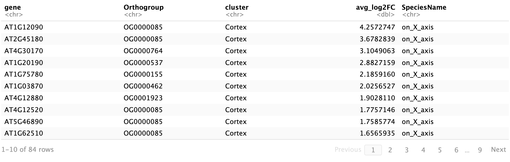

# Orthologous marker groups reveal broad cell identity conservation across single-cell transcriptomes in plants. 

### Introduction:
Despite the widespread application of single-cell RNA sequencing (scRNA-seq) inplant biology, the scarcity of known cell-type marker genes and the divergence of marker expression patterns limit the accuracy of cell-type identification in many species. To address this challenge, we have devised a novel computational strategy called Orthologous Marker Gene groups (OMGs) which can identify cell types in both model and non-model plant species. Our method does not depend on the complexity of cross-species data integration, thus is highly efficient, while still accurately determining inter species cellular similarities of diverse species. We validated our approach by analyzing published single-cell data from Arabidopsis,rice, and maize, and confirmed its accuracy in identifying cell types in tomato root and shoot apex tissues. The robustness of our method was further demonstrated by a successful mapping of 268 cell clusters from 1 million cells across 15 diverse plant species and various tissue types. Our findings suggest that the OMGs method, informed by reference single-cell maps, can accurately annotate cell types for most monocot and dicot species. 


### Requirements:
* R version 4.1.0 or higher </br>
* Matrix package version 1.6-4</br>    
* Seurat package version 4.1.1 </br>
* SPmarker package and its dependencies including Python, pandas, sklearn, shap, keras </br>
* OrthoFinder software version 2.5.4 </br>
* Shiny package for web browser version 1.8.0 </br>
* ggplot2 version 3.4.4 </br>
* reshape version 0.8.9 </br>
* hablar version 0.3.2 </br>

### Quick start:

- `git clone https://github.com/LiLabAtVT/OrthoMarkerGeneGroups.git`

Unzip files
- `cd OrthoMarkerGeneGroups
  find . -name "*.zip" -exec sh -c 'cd "$(dirname "{}")" && unzip -o "$(basename "{}")"' \;`
      
```R
# Load packages
# install.packages("Seurat") # install packages if you don't have them
library(tidyverse); library(ggplot2); library(reshape); library(hablar); library(Seurat)

# Load available marker genes
MGs = read.csv("Step1_FindMarkerGenes/MG_example.csv", row.names = 1)
source("Step1_FindMarkerGenes/MG_extraction.R")
MG_species1 = MarkerGenes("Arabidopsis_thaliana", "Leaf") # 1st parmeter is species name, 2nd parameter is tissue type
MG_species2 = MarkerGenes("Brassica_rapa", "Leaf")


# Create orthologous marker gene groups
orthofinder = read.csv("Step2_OrthoFinder/Orthogroups.tsv", header = TRUE, sep = "\t")
source("Step2_OrthoFinder/convert_MG_to_OMG.R")
Arabidopsis_OMG = merge_MG_OG(MG_species1, clean_OG(orthofinder, "Arabidopsis_thaliana"), "Arabidopsis_thaliana")
Brassica_OMG = merge_MG_OG(MG_species2, clean_OG(orthofinder, "Brassica_rapa"), "Brassica_rapa")


# Create pairwise comparison heatmap
source("Step3_PairwiseComparison/count_comOMGs.R")
df_commonOMGs = test_significant(Arabidopsis_OMG, Brassica_OMG, 0.01)
plot_ATH_BRA = generate_plot_comparison(df_commonOMGs, "Arabidopsis_thaliana", "Brassica_rapa")
plot_ATH_BRA

# Extract data from the heatmap
extract_table(Arabidopsis_OMG, Brassica_OMG, 0.001)

# Compare with 15 species
source("Step3_15SpeciesComparison/compare15species.R")
table15species = compare_w_15_species("Step1_FindMarkerGenes/MG_Tomato.csv")
table15species
write.csv(table15species, "Step3_15SpeciesComparison/Compare_w_15Species.csv")
```
This will take a few minutes.

### Detailed processing:
#### Step 1, Find cell type marker genes:
Identify marker genes in plant species using Seurat package
```R
# load packages
library(Seurat)

# load Seurat object
Seurat_obj <- readRDS("Seurat_object.rds")

# Find marker genes
Markers <- FindAllMarkers(Seurat_obj, only.pos = TRUE, min.pct = 0.5, 
              logfc.threshold = 0.5) %>% 
              group_by(cluster) %>% 
              arrange(cluster, desc(avg_log2FC))

# extract data 
saveRDS(Markers, "Markers.RData")
write.csv(Markers, "Markers.csv")
```
Detailed information can be found in this video tutorial: https://youtu.be/oliRmER1rXw

#### Step 2, Find orthologous groups by OrthoFinder:
Convert species marker genes into orthologous marker genes </br>
We provide an orthofinder output file of 15 species including: Arabidopsis_thaliana, Brassica_rapa, Catharanthus_roseus, Fragaria_vesca	Populus_alba_var_pyramidalis, Gossypium_hirsutum, Glycine_max, Gossypium_bickii, Manihot_esculenta, Medicago_truncatula, Nicotiana_attenuata, Oryza_sativa, Populus_alba_x_populus_glandulosa, Solanum_lycopersicum, Zea_mays. This file is in Step2_OrthoFinder/Orthogroups.tsv
```R
# load the orthologous groups which is the output from the orthofinder package
orthofinder = read.csv("Step2_OrthoFinder/Orthogroups.tsv", header = TRUE, sep = "\t") # Unzip the orthogroups.tsv.zip

source("Step2_OrthoFinder/convert_MG_to_OMG.R")
og_ath = clean_OG(orthofinder, "Arabidopsis_thaliana") # EX: Arabidopsis_thaliana
og_oryza = clean_OG(orthofinder, "Oryza_sativa") # EX: Rice (Oryza Sativa)

# load marker genes found in step 1, two examples of Arabidospis and Rice 
MG_ara = readRDS("Step1_FindMarkerGenes/MG_120923_ATH_05.RData")
MG_oryza = readRDS("Step1_FindMarkerGenes/MG_120923_Rice_05.RData")

# Merge marker gene and OG genes
Ath_MG_OG = merge_MG_OG(MG_ara, og_ath, "Arabidopsis_thaliana")  # EX: Arabidopsis_thaliana 
Oryza_MG_OG = merge_MG_OG(MG_oryza, og_oryza, "Oryza_sativa")  # EX: Rice 
```
(Optional) Run the Orthofinder package incase your species not in our available file (Step2_OrthoFinder/Orthogroups.tsv). Gather all sequences files in a folder and run this command line in linux
- `orthofinder -f OrthoFinder_protein_folder`

The expected output will be obtained in this sub folder: 
OrthoFinder_protein_folder/OrthoFinder/Results_date/Orthogroups/Orthogroups.tsv 


#### Step 3, Find conserved orthologous marker genes (OMGs) between species:
Present a comprehensive pairwise comparison of orthologous marker genes for cell type clusters between two plant species, with the aim of generating lists of conserved orthologous marker genes that could be used to identify cell types in other plant species.  </br>

An example of Arabidopsis and Rice
```R
# Load packages
library(ggplot2); library(reshape); library(hablar)

# Function create table of common OMGs between 2 species
source("Step3_PairwiseComparison/count_comOMGs.R")
df_commonOMGs = test_significant(Ath_MG_OG, Oryza_MG_OG, 0.01)

# Create the plot with ggplot
plot_ATH_Rice = generate_plot_comparison(df_commonOMGs, "Arabidopsis", "Rice")
plot_ATH_Rice
```


Extract data from the heatmap. The Species_x_clusters is the clusters of species on the x-axis. The Species_x_numOMG is the unique number of OMG converted from species marker genes. The Species_y_clusters is the clusters of species on the y-axis. The comOMG column consists of the common OMGs between two species' clusters. FDR is the False Discovery Rate to correct for multiple testing. Test is the result "Reject" or "Fail" based on the FDR value.
```R
# Extract table from the heatmap
extract_table(Ath_MG_OG, Oryza_MG_OG, 0.05) 
```


Extract marker genes of common OMGs between two species clusters
```R
# Extract OMG genes
extract_gene(Ath_MG_OG, Oryza_MG_OG, "Cortex", "Cortex") 
```

Detailed information can be found in the R markdown PairwiseComparison_Seurat.Rmd

#### Step 4, Predict cell types in a query species:
Predict cell types in Tomato root and shoot.

```R
# Load packages
library(ggplot2); library(reshape); library(hablar)

# Function create table of common OMGs between 2 species
source("Step3_PairwiseComparison/count_comOMGs.R")
df_commonOMGs = test_significant(Ath_MG_OG, Tomato_MG_OG, 0.01)

# Create the plot with ggplot
plot_ATH_Tomato = generate_plot_prediction(df_commonOMGs, "Arabidopsis", "Tomato")
plot_ATH_Tomato
```


Based on the red boxes highlighted by statisical test, we can predict the cell type for tomato root using arabidopsis marker genes as a reference dataset. </br>
Detailed information for root and shoot prediction can be found in step 4 folder.

#### Mapping cell types across 15 species
This atlas comprises 268 cell clusters, 990,894 cells, and 53,600 marker genes which were obtained from multiple sources. We clustered cell types from different species based on the shared OMGs across species. One outcome of such mapping would be grouping similar cell types into clusters, neglecting any overriding effects of species dominance. 

The color bar is a group of a cell type measured by the euclidean distance. The color scale represents the negative logarithm of the FDR-adjusted p-value. Odd Ratios (OR) represent the likelihood of a particular cell type appearing in a specified group relative to its presence in all other groups. Proportion indicates the frequency of the predominant cell type within each group. Groups are named according to the most prevalent cell type, as indicated by their respective OR and proportion values.
Detailed information can be found in this file (Step4_cellType_prediction/Heatmap_cellType_comparison_across15species.Rmd)

#### Step 5, Web brower:
To facilitate the use of this method by the broad research community, we have launched a user-friendly web-based tool called the OMG browser, which enables effortless identification of cell types in any plant dataset.

Browser: http://orthomarkergenes.org/ </br>
Browser tutorial: https://youtu.be/Jb4uMq394Sg

### Contact:
If you have any questions regarding the OMG methods, please contact me (Tran Chau) at tnchau@vt.edu
